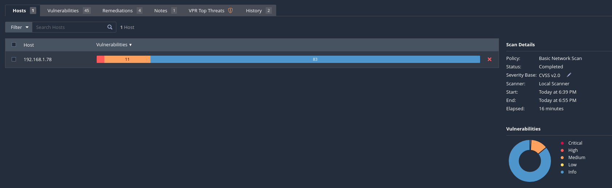
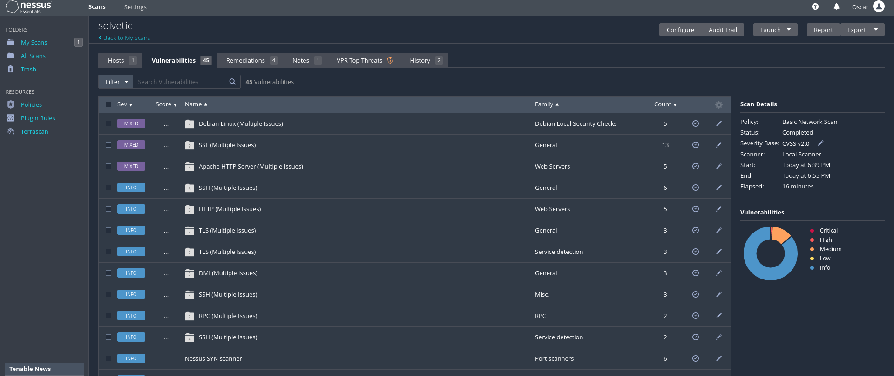
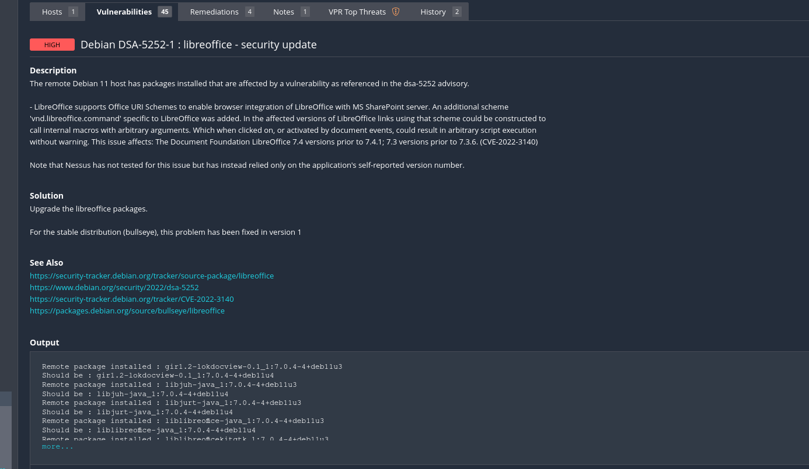

# Análisis de Vulnerabilidades Nessus

Este es el paso que debemos completar antes de hacer la parte de explotación. Pero antes debemos saber que es lo que tenemos que explotar para no estar lanzando códigos maliciosos a lo loco.

Un análisis de vulnerabilidad nos va ha permitir identificar cuales servicios de los cuales nosotros ya enumeramos, son vulnerables a algún tipo de ataque.

En primero lugar haremos un escaneo si no tenemos ninguno, y lo lanzaremos. Cuando esto concluya podemos observar las diferentes categorías de las vulnerabilidades.

Aqui podemos observar como un resumen de las cantidades de vulnerabilidades dependiendo del nivel que encontremos

**Nota:** Esto es bueno que sea revisado ya que una vulnerabilidad de información por ejemplo puede ayudar a comprometer un equipo porque puede obtener un cierto dato y posiblemente sirva para atacar vulnerabilidades mayores o simplemente para descubrir elementos que me permitan encontrar fallos dentro este sistema, aplicaciones que estén corriendo...

Para ver los detaller pincharemos en "Vulnerabilities", y aqui empieza ya cada uno de los detalles dependiendo de su naturaleza

Podemos ir viendo cada uno:

Como vemos nos da una pequeña descripción de cual es la vulnerabilidad, una solición, ciertas referencias e información relevante a CVE que es la vulnerabilidad que fue descubierta y publicada en algún momento

Este tipo de herramientas son útiles porque nos ayudan a no solamente entender cual es el problema sino tambien a aportarte una posible remediación  