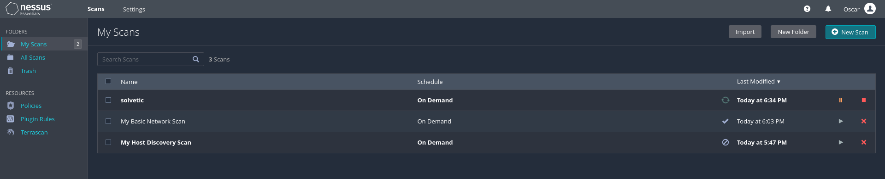

# Configuración inicial y uso de Nessus

**Paso 1** Damos clic en "New Scan" y seleccionamos el tipo de escaneo a usar, como vemos las opciones son variadas:

**Paso 2**

Las opciones de escaneo que nos ofrece Nessus son:

 
**Host Discovery**
Ejecuta un escaneo sencillo para descubrir hosts activos y puertos abiertos

**Basic Network Scan**
Hace un análisis completo del sistema necesario para cualquier host seleccionado, es ideal para analizar vulnerabilidades internas

**Advanced Scan**
Este análisis permite personalizar la configuración del escaneo

**Advanced Dynamic Scan**
Permite configurar filtros de complementos dinámicos sin tener que hacerlo de forma manual

**Malware Scan**
Como su nombre lo indica, busca malware en sistemas Windows y Unix

**Mobile Device Scan**
Permite realizar análisis a dispositivos móviles usando Microsoft Exchange o un MDM

**Web Application Tests**
Es funcional para buscar vulnerabilidades web publicadas y no publicadas o desconocidas

**Credentialed Patch Audit**
Ejecuta una auditoría de parches con credenciales

**Intel AMT Security Bypass**
Se encarga de realizar comprobaciones remotas y locales para CVE-2017-5689

**Spectre and Meltdown**
Se encarga de llevar a cabo verificaciones remotas y locales para CVE-2017-5753, CVE-2017-5715 y CVE-2017-5754

**WannaCry Ransomeware**
Busca el famoso ransomware WannaCry

**Ripple20 Remote Scan**
Ubica equipos que ejecutan la pila Treck en la red

**Zerologon Remote Scan**
Detecta la vulnerabilidad de elevación de privilegios (Zerologon) propia de Microsoft Netlogon

**Solarigate**
Permite encontrar vulnerabilidades de SolarWinds Solorigate usando comprobaciones remotas y locales

**ProxyLogon**
MS Exchange: ejecuta comprobaciones remotas y locales para detectar vulnerabilidades de Microsoft Exchange Server

**PrintNightmare**
Hace análisis y verificaciones locales para CVE-2021-34527, es una vulnerabilidad PrintNightmare Windows Print Spooler

**Active Directory Starter Scan**
Busca configuraciones incorrectas en Active Directory

**Log4Shell**
Puede detectar la vulnerabilidad Log4Shell en Apache Log4j

**Compliance**
Hace una auditoría de la infraestructura de la nube y audita la configuración de servicios en la nube de terceros

**Internal PCI Network Scan**
Lleva a cabo un análisis de vulnerabilidad PCI DSS interno

**MDM Config Audit**
Audita la configuración de los administradores de dispositivos móviles MDM

**Offline Config Audit**
Hace una auditoria de la configuración de los dispositivos de red locales

**Policy Compliance Auditing**
Lleva a cabo una auditoria de las configuraciones del sistema tomando como base una línea de base existente

**SCAP and OVAL Auditing**
Analiza sistemas de auditoría a través de definiciones SCAP y OVAL

Podemos ver como las opciones son variadas y funcionales.

Damos clic en "Basic Network Scan" para un escaneo básico e ingresamos los detalles del escaneo con la IP objetivo:

**Paso 3** Damos clic en el icono "Launch" para iniciar el escaneo en el equipo de destino:

**Paso 4** Esperamos que el escaneo sea realizado, al finalizar pulsamos sobre el objetivo para ver las vulnerabilidades encontradas:

**Paso 5** Cada una estará dividida por colores en base a su nivel de riesgo indicando la cantidad y al lado podemos ver una representación de estas, damos clic sobre alguna sección para ver más específicamente las vulnerabilidades detectadas:

**Paso 6** Es posible ver un resumen de todas las vulnerabilidades de ese tipo y damos clic en algún elemento para tener acceso a detalles más completos:

**Paso 7** Es posible guardar un reporte del análisis ejecutado, para ello damos clic en "Report":

**Paso 8** Se abrirá la siguiente ventana donde seleccionamos el formato y detalles a usar:

**Paso 9** Damos clic en "Generate Report" y después de creado lo abrimos o guardamos:

**Paso 10** Este reporte contendrá todo el resultado generado por Nessus y navegamos por las diferentes paginas para ver los resultados:

