# Despliegue de aplicaciones python

[Página del ejercicio.](https://fp.josedomingo.org/iaw2223/4_python/practica.html)

## Tarea 1: Entorno de desarrollo

**Paso 1** [Clonar el repositorio de GitHub.](https://github.com/josedom24/django_tutorial)

Para la clonación tenemos a nuestra disposición 3 protocolos diferentes de los que podemos hacer uso. En mi caso voy a utilizar el protocolo SSH, ya que tengo introducida mi clave pública en mi cuenta de GitHub. Cuando hayamos obtenido la URI de descarga, se la pasaremos a `git clone`:

    git clone <<URL de descarga>>

Y una vez hecho esto el repositorio de nombre django_tutorial ha sido correctamente clonado en nuestra máquina local y podremos empezar a hacer uso del mismo.

**Paso 2** Crear un entorno virtual de Python.

Instalaremos los paquetes necesarios para que la aplicación funcione. Para la correspondiente creación de un entorno virtual, debemos instalar previamente el paquete necesario (python3-venv), ejecutando para ello el comando:

    sudo apt install python3-venv

Podemos crear este entorno en una carpeta a parte. Ejecutaremos el entorno con el siguiente comando:

    python3 -m venv <<Nombre del entorno>>

Una vez creado, tendremos que iniciarlo haciendo uso de source con el binario activate que se encuentra contenido en el directorio bin/:

    source <<Nombre del entorno>>/bin/activate

Y hecho esto nuestro entorno habrá sido habilitado.

**Paso 3** Instalar paquetes necesarios para la aplicación.

Estos paquetes lo entontraremos en el fichero `requirements.txt` que se entre los ficheros que hemos clonado del GitHub

Nos desplazaremos hacia el con el comando `cd` e instalaremos los paquetes que se encuentan en el con el siguiente comando:

    pip install -r requirements.txt

Para demostrarlo, vamos a leer el contenido del fichero settings.py existente en el subdirectorio django_tutorial/ previamente mencionado, para así visualizar la sección referente al uso de la base de datos, haciendo para ello uso del comando:

    cat django_tutorial/settings.py

Dentro del mismo, encontraremos una sección de nombre DATABASES, que por defecto tendrá la siguiente forma:

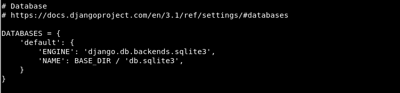

Como se puede apreciar, la base de datos es de tipo sqlite3, un tipo de base de datos muy pequeña, tan pequeña que se encuentra contenida en un fichero, que todavía no se encuentra generado. Para generarlo, tendremos que aplicar las migraciones:

    python3 manage.py migrate

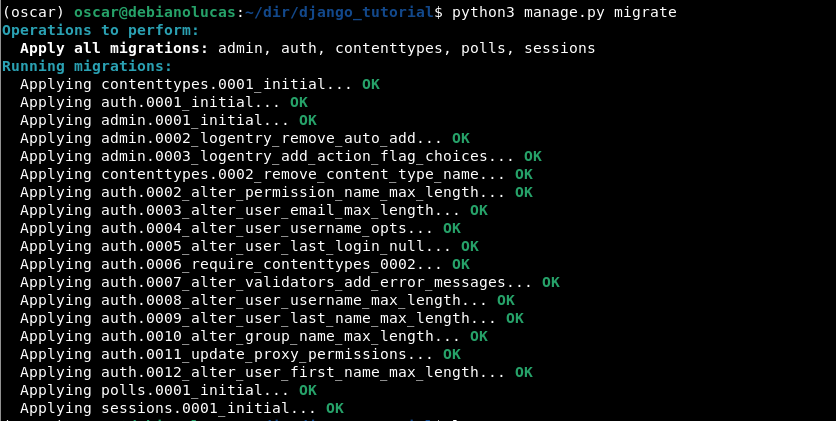

Para verificar que el fichero que contiene la base de datos sqlite3 ha sido correctamente generado, listaremos el contenido del directorio:

Efectivamente, un fichero de nombre db.sqlite3 ha sido generado, que contendrá todas las tablas necesarias.

La aplicación se encuentra ya instalada en su totalidad, de manera que vamos a proceder a crear un usuario administrador de dicho proyecto, que tendrá privilegios suficientes para acceder a la zona de administración, ejecutando para ello el comando:

    python3 manage.py createsuperuser

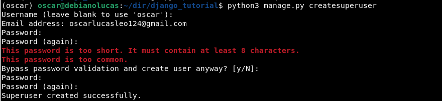

Se nos ha solicitado un nombre de usuario para el mismo, un correo electrónico y una contraseña, así que una vez creado, vamos a proceder a arrancar el servidor web ligero que nos proporciona Django:

    python3 manage.py runserver

Y una vez hecho esto ya prodremos acceder al servidor web, poniendo en el navegador `localhost:8000/admin` para acceder a la zona de administración.

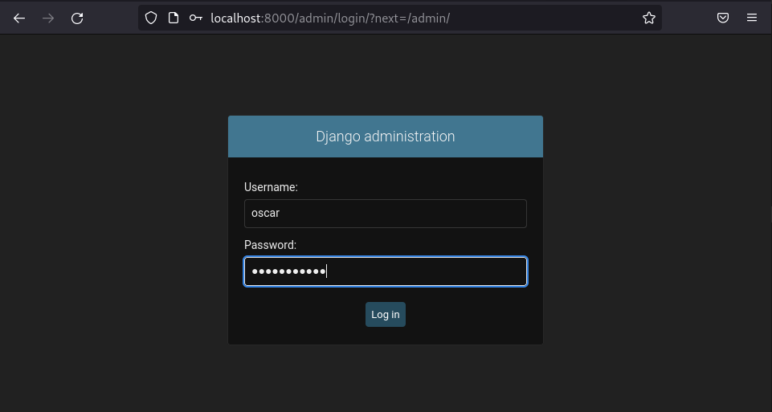

Una vez hayamos accedido a la zona de administración, se nos solicitarán los credenciales del usuario administrador que acabamos de generar, así que tras introducirlos, pulsaremos en **Log in**.

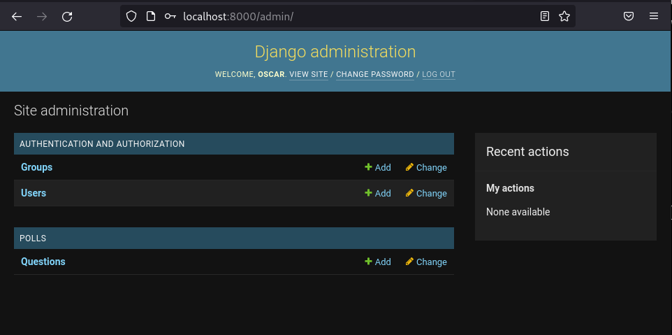

Y como podemos comprobar el acceso a la zona de administración ha funcionado correctamente.

Para comprobar el funcionamiento de esta última aplicación, vamos a añadir dos nuevas preguntas, pulsando para ello en **+ Add** en el apartado **Questions** de la sección **polls**

En mi caso, he creado la pregunta “¿Cuál es tu color favorito?” con 4 posibles respuestas, indicando a su vez la fecha y hora de inicio de la encuesta. Cuando hayamos finalizado, pulsaremos en **Save and add another** para así añadir una segunda encuesta de prueba la cual dice "¿Qué marca de portátil prefieres?" con 3 posibles respuestas. Por último, pulsaremos en **SAVE** para añadirla y volver a la zona de administración::

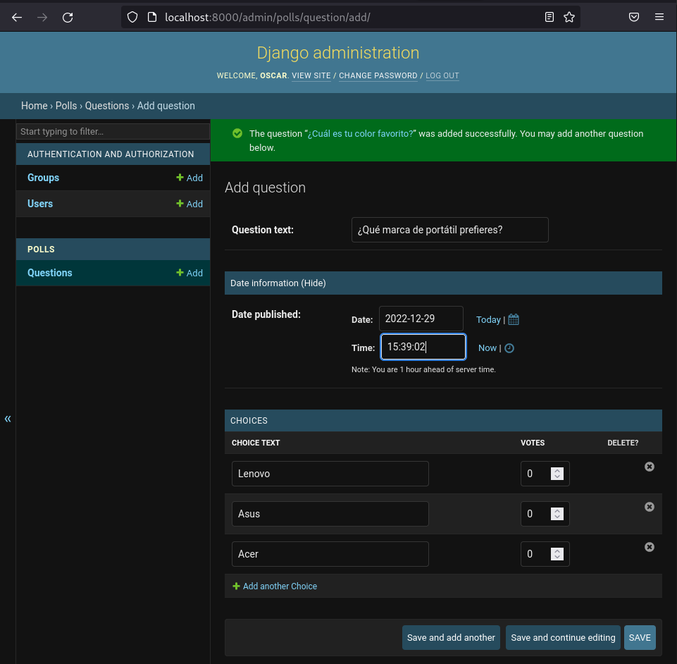

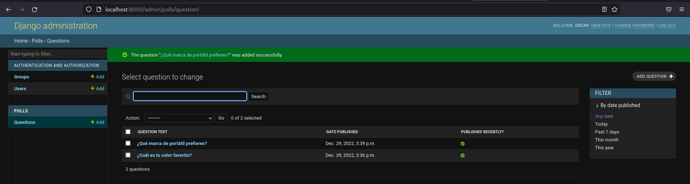

Como se puede apreciar, las dos preguntas han sido correctamente generadas, así que accederemos tras ello a la ruta **/polls** para así hacer uso de dicha aplicación, en la que se mostrarán las encuestas existentes y nos permitirá votar entre las diferentes posibilidades:

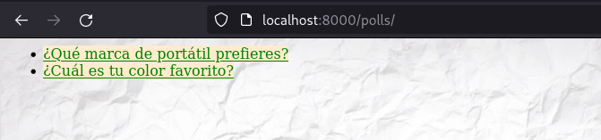

Efectivamente, ambas encuestas han sido mostradas, de manera que accederemos a la primera de ellas para verificar que todo funciona como debería:

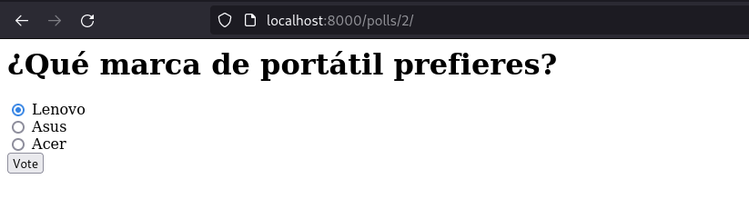

Y haremos uso de la votación:

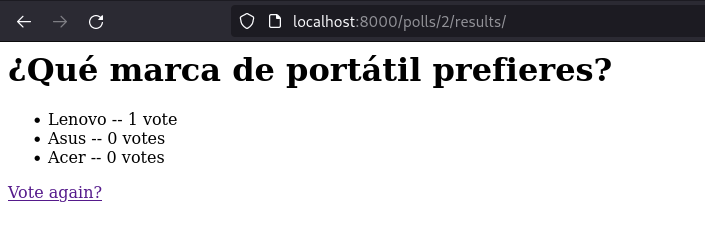

Efectivamente, el voto ha sido correctamente registrado y los resultados actuales, mostrados.

Vamos a comprobar qué ha ocurrido de una forma más interna, volviendo a la terminal y utilizando un cliente sqlite3 que tenía instado con anterioridad, para así hacer uso de la base de datos existente. El comando a ejecutar sería:

    sqlite3 db.sqlite3

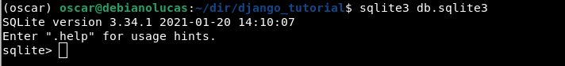

Una vez dentro del cliente con la correspondiente base de datos abierta, vamos a ejecutar la instrucción necesaria para listar las tablas existentes en la misma:

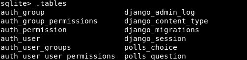

En la salida de la instrucción se han mostrado todas las tablas resultantes de haber aplicado las correspondientes migraciones, siendo **polls_question** aquella en la que se almacenarán las dos preguntas que hemos creado, así como **polls_choice** aquella en la que se almacenarán las posibles respuestas y los votos realizados para cada una de ellas. Vamos a proceder a comprobar el contenido de ambas, ejecutando para ello las instrucciones:

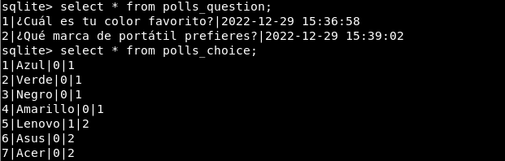

## Tarea 2: Entorno de producción