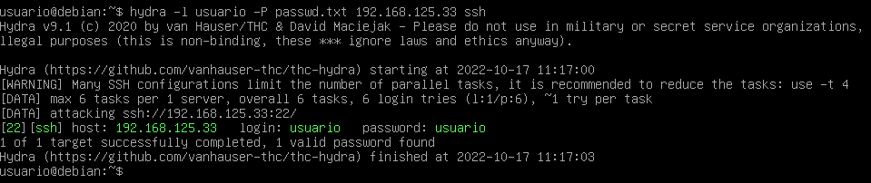

# Hydra en Debian 11

## Instalación de Hydra en Debian 11

**Instale hydra usando apt**

Actualice la base de datos apt con apt-get usando el siguiente comando.

    sudo apt update

Después de actualizar la base de datos apt, podemos instalar hydra usando apt-get ejecutando el siguiente comando:

    sudo apt -y install hydra

Esto tardará un poco

**Cómo desinstalar Hydra en Debian 11**

Para desinstalar solo el paquete hydra podemos usar el siguiente comando:

    sudo apt-get remove hydra

*Desinstalar hydra y sus dependencias*

Para desinstalar Hydra y sus dependencias que Debian 11 ya no necesita, podemos usar el siguiente comando:

    sudo apt-get -y autoremove hydra

*Eliminar configuraciones y datos de hydra*

Para eliminar la configuración y los datos de Hydra de Debian 11, podemos usar el siguiente comando:

    sudo apt-get -y purge hydra

*Eliminar la configuración, los datos y todas sus dependencias de Hydra*

Podemos usar el siguiente comando para eliminar las configuraciones de hidra, los datos y todas sus dependencias, podemos usar el siguiente comando:

    sudo apt-get -y autoremove --purge hydra

## Ataque de diccionarios usando Hydra

Para descifrar las contraseñas a traves de un diccionario ejecutaremos el siguiente comando: 

Pero antes crearemos un fichero donde guardaremos las contraseñas 

Aqui dejo un fichero el cual contiene 10000 contraseñas más comunes por los usuarios que podemos utilizar a la hora de ejecutar este comando

<a href="https://dl.dropbox.com/s/x2pdf13f65c2obm/passwd.txt" download="">passwd.txt</a>

Eso lo que hará es si la contraseña que queremos averiguar esta dentro del fichero nos mostrará cual es, en cambio si no esta no nos mostrará ninguna

    hydra -l "nombre del user atacado" -P "ruta del fichero de passwd" ssh

- **-l**: login del user
- **-P**: password

## Ataque de fuerza bruta usando Hydra

## Generación de diccionario usando Hydra

## Ataque a Linux usando Hydra

## Ataque a Windows usando Hydra

## Ataque a Apache usando Hydra

## Ataque a MySQL usando Hydra