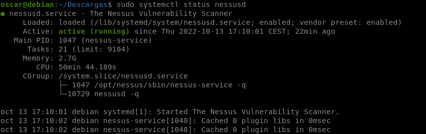
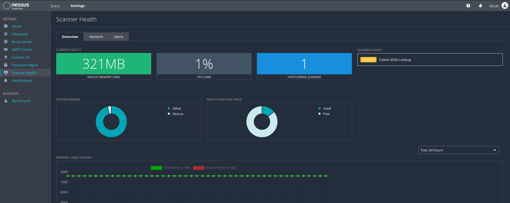

# Instalación Nessus

## Instalación en Debian 11

**Paso 1** Descargue el paquete Deb de Nessus Scanner

Tenable ofrece el escáner Nessus a través del binario Deb, que el usuario debe descargar de su sitio web oficial para instalarlo. Por lo tanto, visite la página de descarga de Nessus y desplácese hasta encontrar el sistema operativo Debian Linux y descárguelo.

[Página de descarga](https://www.tenable.com/downloads/nessus?loginAttempted=true)

**Paso 2** Comando para instalar Nessus en Debian 11

Ya hemos descargado el binario de Debian para configurar Nessus en Linux, ahora todo lo que descarguemos del navegador va a la carpeta Descargas, así que cambie a eso primero.

    cd Descargas

Ahora, use el paquete APT para instalar el archivo.

    sudo apt install ./Nessus-10.3.0-debian9_amd64.deb

**Paso 3** Habilitar e iniciar los servicios del escáner

Una vez que se complete la instalación, habilitemos su servicio para que se ejecute automáticamente con el arranque de Debian 11 y también comencemos lo mismo para la sesión actual.

    sudo systemctl enable --now nessusd

Para comprobar el estado, escriba

    sudo systemctl status nessusd

**Paso 4** Permitir el puerto de Nessus a través del firewall

Nessus se ejecuta en el puerto número 8834, por lo tanto, para acceder a su interfaz web de forma remota mediante el navegador, debemos abrir este puerto en nuestro firewall Debian 11.

    sudo apt-get install ufw
    sudo ufw enable
    sudo ufw allow 8834

**Paso 5** Acceder a la interfaz web

Ahora, abra un navegador en un sistema que pueda acceder a la dirección IP del servidor donde instaló la instancia del escáner Nessus. Y señale eso junto con un número de puerto.

    https://server-ip-address:8834

Reemplace la dirección IP del servidor con la IP real de su Debian 11.

**Nota:** Si obtiene un error de certificado SSL, haga clic en el botón Avanzado y continúe de manera insegura.

**Paso 6** Elija cómo desea implementar Nessus: configuración en Debian 11

La página web inicial de Nessus le pedirá que seleccione el producto que desea instalar. Aquí, la primera opción de producto que obtiene es de uso gratuito, mientras que el resto se paga, pero está disponible con un período de prueba.

- **Nessus Essentials:** la versión gratuita para educadores, estudiantes y aficionados
- **Nessus Professional:** la solución de evaluación de vulnerabilidades estándar de la industria de los profesionales de la seguridad.
- **Nessus Manager:** la solución empresarial para administrar Nessus Agent a escala.
- **Escáner administrado:** vincule su escáner a otra solución de Tenable, como Tenable.io y Tenable. Carolina del Sur.

**Paso 7** Obtenga el código de activación

Ingrese su dirección de correo electrónico y otros detalles para obtener el código de activación, de modo que podamos activar el producto para usarlo más. La mejor manera de obtener el código es visitar la página de registro, registrarse para obtener una versión profesional o gratuita para obtener una de activación.

Después de eso, haga clic en el botón Omitir y agregue el código que recibió en su correo electrónico.

Una forma alternativa de activar Nessus mediante la línea de comandos (**opcional**).

    sudo -i
    export PATH=$PATH:/opt/nessus/sbin/ 
    source ~/.bashrc
    service nessusd stop 
    /opt/nessus/sbin/nessuscli fix --reset 
    /opt/nessus/sbin/nessuscli fetch --register ACTIVATION-CODE-HERE 
    /opt/nessus/sbin/nessusd -R 
    service nessusd start

**Paso 8** Crear usuario

Cuando el sistema le pida que cree un usuario Nessus Admin, créelo configurando un nombre de usuario y la contraseña correspondiente. Después de eso, tendrá el Nessus funcionando en su sistema.

**Paso 9** Agregue el comando NessusCLI a la ruta del sistema

De forma predeterminada, para acceder a la línea de comandos de Nessus, debemos definir la ruta completa para la herramienta nessuscli en la terminal de nuestro sistema Debian 11. Para eliminar esto, solo necesitamos agregar su carpeta de herramientas CLI a la ruta de nuestro sistema. Conozca más sobre su línea de comando en la [página oficial de Doc](https://docs.tenable.com/nessus/Content/NessusCLI.htm).

Ejecute el siguiente comando en la terminal Debian 11:

    sudo -i
    export PATH=$PATH:/opt/nessus/sbin/
    source ~/.bashrc

    nessuscli help

**Paso 10** Desinstale Nessus de Debian 11 o 10 (**opcional**)

Si ya no desea el escáner de vulnerabilidades Nessus en su Debian 11 o 10, use el comando bewloc para eliminarlo.

    sudo systemctl stop nessusd

    sudo apt remove nessus 