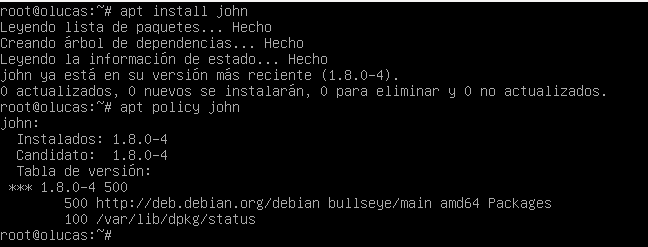
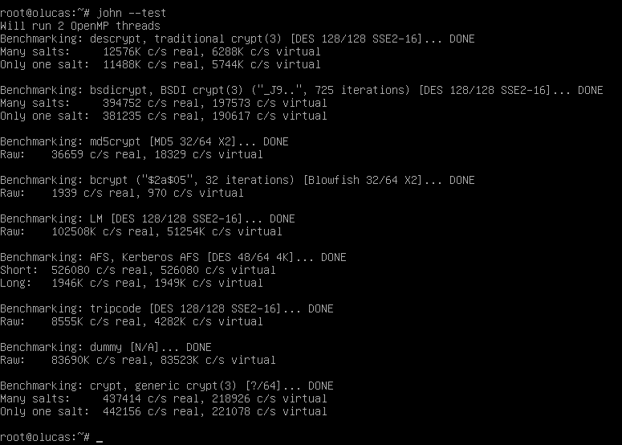
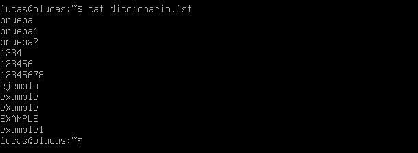

# John The Ripper

**Paso 0** Instalación 

Para instalar John the Ripper ejecutaremos el siguiente comando

    apt install john

lo primero que deberemos de hacer es comprobar que funciona correctamente en nuestro sistema, para ello lanzaremos el siguiente comando:

    john --test

**Paso 1** Crackeo de contraseña de usuario en linux por fuerza bruta

Una vez instalada y testeada la herramienta podemos empezar por un caso real, por ejemplo, cargar directamente el archivo `/etc/shadow` y probar a descifrar contraseñas. Pero, para este caso de ejemplo, vamos a crear un fichero con la clave de un usuario muy simple para hacer de forma rápida esta prueba.

Para realizar la prueba vamos a crear un fichero de texto en el directorio que deseemos e incluiremos en el mismo el siguiente contenido:

   echo user:AZl.zWwxIh15Q > password.txt

Ahora ejecutaremos john sobre el fichero que acabamos de crear:

    sudo john password.txt

**Paso 2** Crackeo de contraseña de usuario en linux por ataque de diccionario

Crearemos un diccionario para realizar el ataque, en nuestro caso hemos hecho un diccionario muy simple que incluye el siguiente contenido:

    cat diccionario.list

Ahora ejecutaremos john de nuevo con la opción --wordlist para indicarle que utilice el diccionario que acabamos de crear, quedando el comando de la siguiente forma:

    john --wordlist=diccionario.lst password.txt 

Y al igual que en el anterior caso, pasado un tiempo nos encontrará la contraseña del fichero que podremos ver con el comando:

    john --show password.txt

Y esto es todo, como hemos visto John es una herramienta muy potente y que puede resultar muy útil en según que casos.
