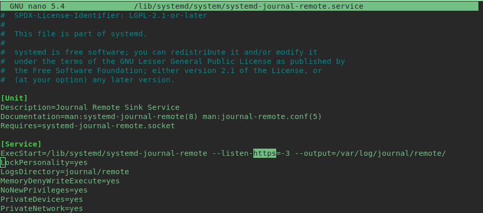
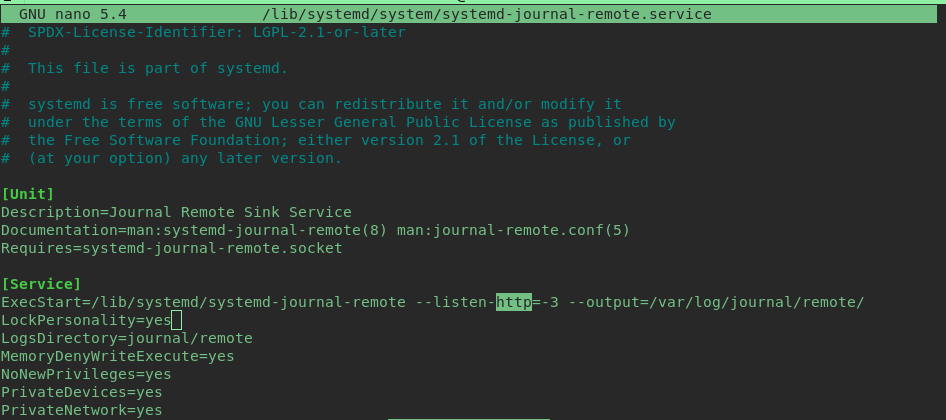
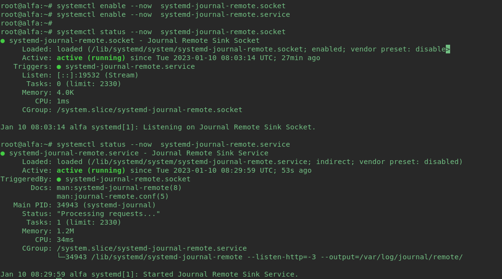
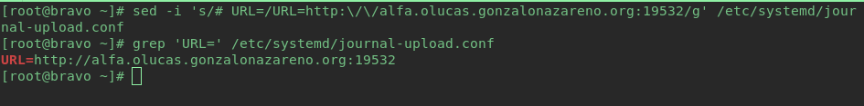
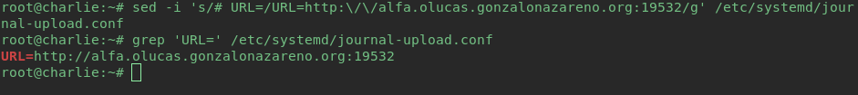
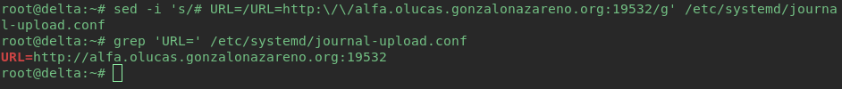
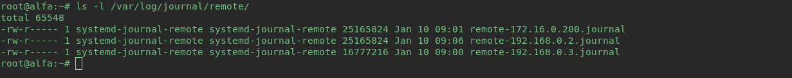
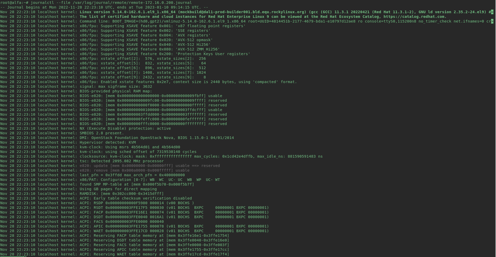
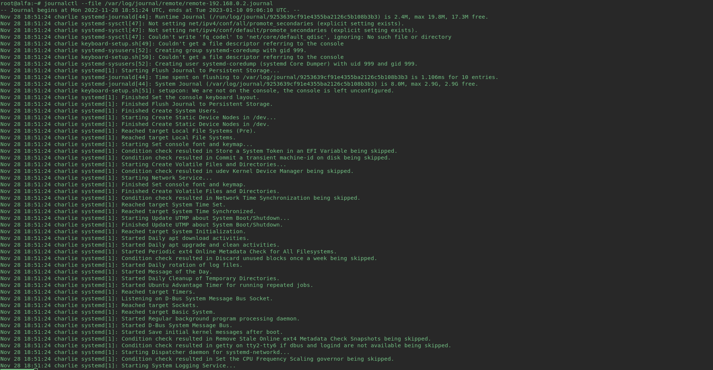
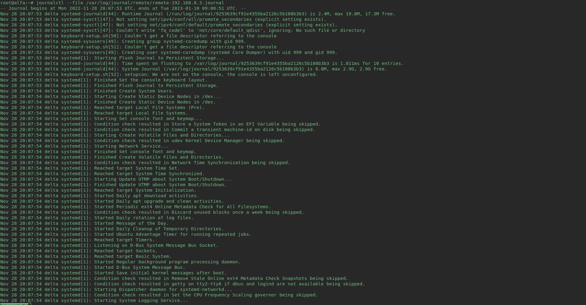

# Recolección centralizada de logs de sistema, mediante journald.

Lo primero que hare es instalar en cada maquina "systemd-journal-remote", con el siguiente comando:

**Alfa, Charlie, Delta**

    sudo apt install systemd-journal-remote

**Bravo**

    sudo dnf install systemd-journal-remote

***El servidor que contenga los logs sera Alfa***

Como https no lo utilizare para la comunicacion, desactivare dicha la opcion en el fichero `/lib/systemd/system/systemd-journal-remote.service`

Para ello editare el fichero y cambiare el `https` por `http`:

Le asignamos el propietario correspondiente:

    sudo chown systemd-journal-remote:systemd-journal-remote /var/log/journal/remote/

**Nota**: Si el fichero "/var/log/journal/remote" no existe lo crearemos

Una vez tenga el servidor receptor configurado, lo siguiente sera configurar cada cliente para hacer que envie sus logs.

***Los servidores que enviaran los logs seran: Bravo, Charlie y Delta***

En cada cliente creare un usuarios llamado systemd-journal-upload, con el "home" en "/run/systemd", con el login deshabilitado y en el grupo systemd-journal-upload:

**Bravo**

    sudo adduser --system --home-dir /run/systemd --no-create-home --user-group systemd-journal-upload

**Charlie y Delta**

    sudo adduser --system --home /run/systemd --no-create-home --disabled-login --group systemd-journal-upload

Tras crear los usuarios, modificaremos la configuraciondel fichero `/etc/systemd/journal-upload.conf` para que los clientes envien los logs a Alfa. Con el comando `sed` cambiare la linea `# URL=` para que contenga la direccion y el puerto de Alfa:

++Bravo, Charlie y Delta**

    sudo sed -i 's/# URL=/URL=http:\/\/alfa.olucas.gonzalonazareno.org:19532/g' /etc/systemd/journal-upload.conf 

Una vez hecho esto reiniciaremos el servicio `systemd-journal-upload` en cada cliente:

**Bravo, Charlie, Delta**

    sudo systemctl restart systemd-journal-upload.service

### Comprobación

Si ahora comprobamos el directorio `/var/log/journal/remote` en Alfa, podremos ver como se han creado los archivos de logs de los clientes, con el nombre `remote-IpCliente.journal`:

**Nota**: Si aparecen solo dos (normalmente es Charlie el que no aparece), hay que añadir en el fichero "/etc/hosts" '192.168.0.1 alfa.olucas.gonzalonazareno.org alfa'

Para comprobar que los logs se estan enviando correctamente, usare el comando "journalctl"  para ver los de cada cliente

    sudo journalctl --file /var/log/journal/remote-IpCliente.journal

**Bravo**

**Charlie**

**Delta**

Se puede observar que los logs estan llegando correctamente a Alfa por lo que el sistema de recoleccion de logs esta funcionando perfectamente.