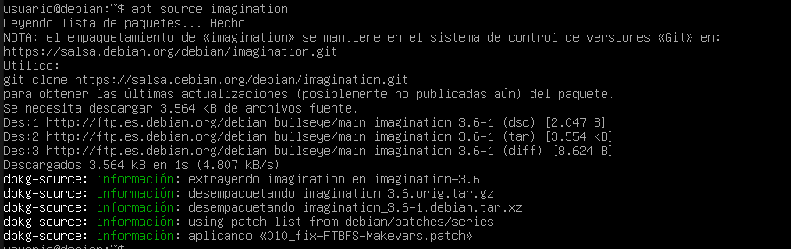
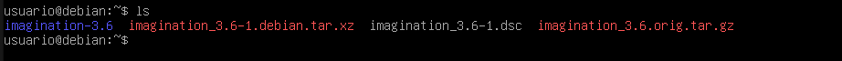
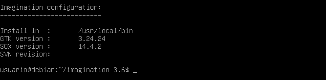
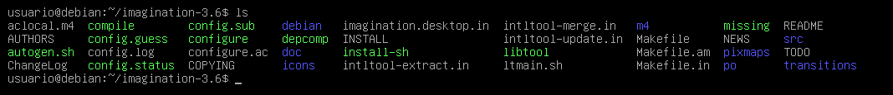

# Compilación de un programa en C utilizando un Makefile

Aqui dejo la url de la web de [Debian](https://packages.debian.org/bullseye/imagination) donde se encuentra la compilación del paquete imagination.

**Paso 1** Descarga del código fuente

Primero instalaremos dpkg-dev

    sudo apt install dpkg-dev

Despues instalaremos imagination con el comando `apt source`

    apt source imagination

**Paso 2** Instalación dependencias

Para instalar las dependencias utilizaremos el comando `apt build-dep`

    sudo apt build-dep imagination

**Paso 3** Compilación del paquete

Para poder compilar el paquete nos moveremos a la carpeta descomprimida

    cd imagination-3.6/

    ./configure

Y despues de esto ejecutaremos el comando `make`

    make

**Paso 4** Instalación del paquete

Una vez ya este compilado ejecutaremos:

    sudo make install

Y con esto ya tendriamos instalado el paquete

**Paso 5** Desinstalación del paquete

Para poder desinstalar el paquete debemos ejecutar:

    cd imagination-3.6/

    sudo make uninstall

Y con esto ya estaría desinstalado