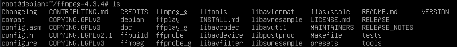
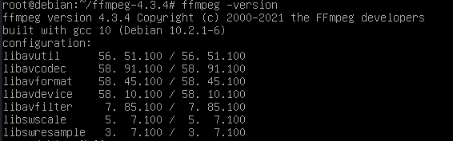
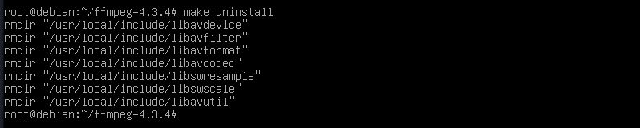

# Compilación de un programa en C utilizando un Mekafile

Aqui dejo la url de la web de [Debian](https://packages.debian.org/bullseye/ffmpeg) donde se encuentra la compilación del paquete ffmpeg.

**Paso 1** Descarga del código fuente

Primero instalaremos dpkg-dev

    sudo apt install dpkg-dev

Despues instalaremos ffmpeg con el comando `apt source`

    apt source ffmpeg

**Paso 2** Instalación dependencias

Para instalar las dependencias utilizaremos el comando `apt build-dep`

    sudo apt build-dep ffmpeg

**Paso 3** Compilación del paquete

Para poder compilar el paquete nos moveremos a la carpeta descomprimida

    cd ffmpeg-4.3.4/

    ./configure

Y despues de esto ejecutaremos el comando `make`

    make

**Paso 4** Instalación del paquete

Una vez ya este compilado ejecutaremos:

    sudo make install

**Paso 5** Comprobación de instalación

Para comprobar que se ha instalado ejecutamos:

    ffmpeg -version

**Paso 6** Desinstalación del paquete

Para poder desinstalar el paquete debemos ejecutar:

    cd ffmpeg-4.3.4

    sudo make uninstall

Y con esto ya estaría desinstalado

## Creación de un paquet .deb

Para crear un paquete .deb sigue los siguientes pasos

    sudo apt update
    sudo apt install dpkg-dev
    apt source ffmpeg
    sudo apt build-dep ffmpeg

Despues de esto nos moveremos a la carpeta descomprimida

    cd ffmpeg-4.3.4
    dpkg-buildpackage -rfakeroot -b -uc -us

Funciones de `dpkg-buildpackage`:

- **-rfakeroot**: Crea un entorno fakeroot que simula privilegios de root (para evitar problemas de propiedad y permisos).
- **-b**: Construye el binario.
- **-uc**: No firma el changelog.
- **-us**: No firma el source.

Comprobamos que el archivo .deb se ha generado en la carpeta superior

    ls .. | grep "^ffmpeg.*deb$"

Para instalarlo utilizaremos `dpkg`, pero también podemos utilizar `apt install`

Antes de instalarlo debemos instalar las dependencias que necesita (libavdevice58)

    sudo apt install libavdevice58

Y despues de esto ya podriamos instalarlo

    cd ..

    sudo dpkg -i ffmpeg_4.3.4-0+deb11u1_amd64.deb
