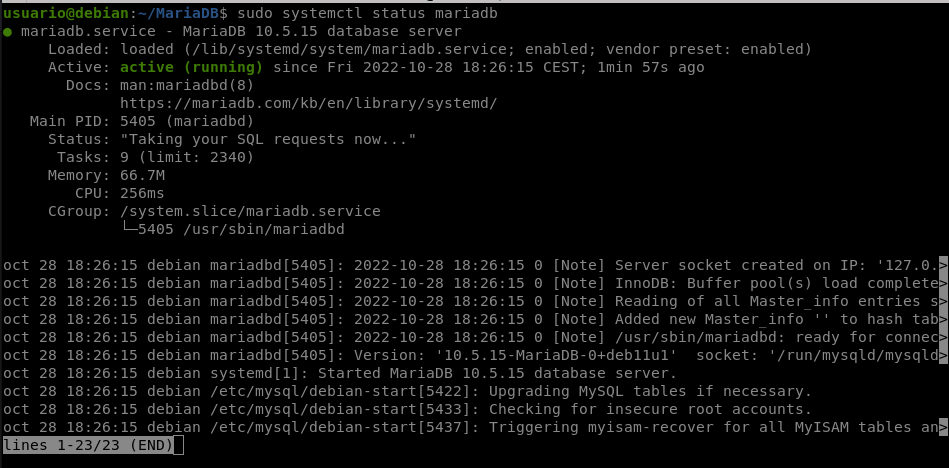
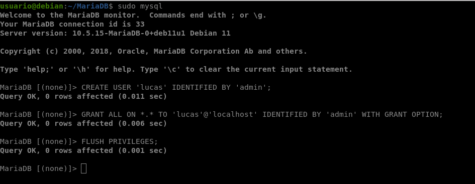
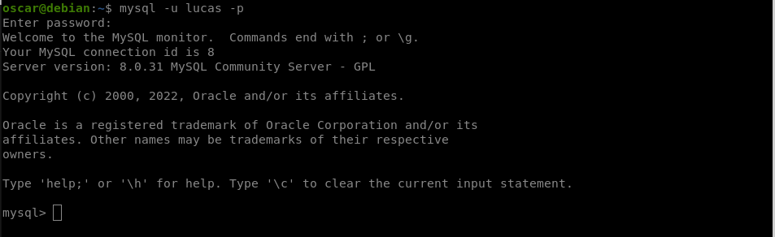
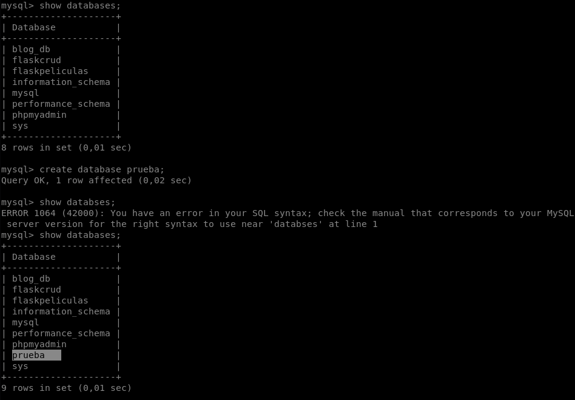
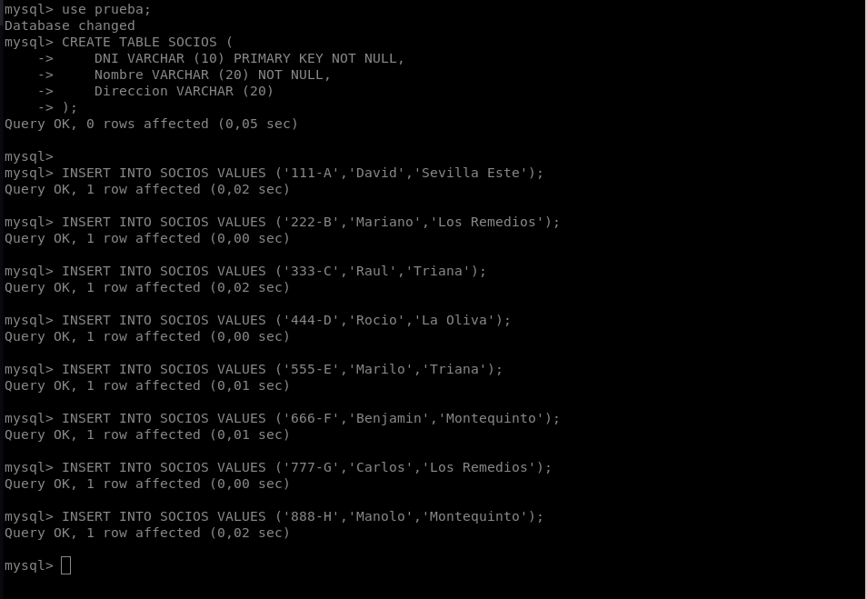
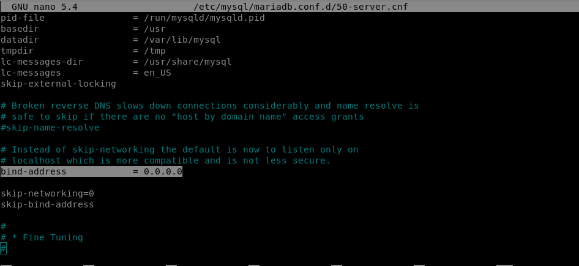
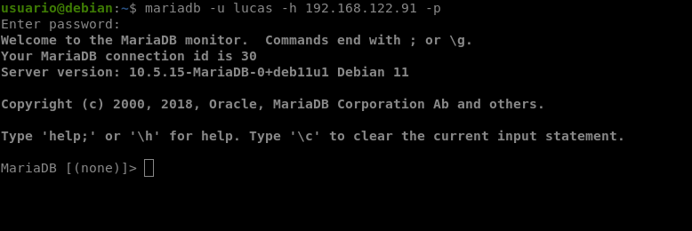

# MariaDB en Debian 11 Bullseye

Para conseguir una instalación correcta debemos cumplir los siguientes requisitos:

<input type="checkbox" name="vehicle" value="Bike"> Tener una máquina Debian 11 actualizada

<input type="checkbox" name="vehicle" value="Bike"> Tener un usuario con privilegios de sudo

<input type="checkbox" name="vehicle" value="Bike"> Tener acceso a internet

Antes de comenzar con la instalación actualizaremos nuestra máquina

    sudo apt update && sudo apt upgrade

Una vez completada la actualización del sistema, ejecuta el siguiente comando para instalr los paquetes necesarios

    sudo apt-get install software-properties-common dirmngr gnupg2 -y
---
    sudo apt-get install apt-transport-https wget curl -y

## Instalar MariaDB en Debian 11

Para comenzar con la instalación ejecuta el siguiente comando:

    sudo apt install mariadb-server -y

Para iniciar, detener y reiniciar el servidor de bases de datos MariaDB, utiliza los siguientes comandos:

Iniciar

    sudo systemctl start mariadb

Detener

    sudo systemctl stop mariadb

Reiniciar

    sudo systemctl restart mariadb

Para que MariaDB se inicie automáticamente al arrancar el sistema, ejecuta el siguiente comando:

    sudo systemctl enable mariadb

MariaDB debería estar en marcha en este momento. Puedes comprobar si se esta ejecutando, ejecutando el siguiente comando:

    sudo systemctl status mariadb

Ejemplo de salida:

`Ctrl + C` para salir del fichero

Y con esto ya tendriamos instalado MariaDB y para ejecutarlo, ejecutaremos el siguiente comando:

    sudo mysql

## Creación de usuario

Los siguientes pasos que vas a ver se ejecutan dentro de MariaDB (cambia el usuario y la contraseña por los tuyos)

    CREATE USER 'lucas' IDENTIFIED BY 'admin';
---
    GRANT ALL ON *.* TO 'lucas'@'localhost' IDENTIFIED BY 'admin' WITH GRANT OPTION;
---
    FLUSH PRIVILEGES;

Y una vez ya creado el usuario salimos de MariaDB ejecutando `exit;`
Y para conectarnos a nuestro usuario ejecutaremos el siguiente comando:

    mysql -u lucas -p

### Creación de base de datos

Para ejecutar una base de datos ejecutaremos el siguiente comando:

    mysql> CREATE DATABASE nombre-db;

Para meternos en una base de datos ejecutaremos el siguiente comando:

    mysql> use nombre-db;

Para crear una tabla ejecutaremos el siguiente comando:

    mysql> CREATE TABLE NOMBRE (
        ->     DATO,
        ->     DATO,
        ->     DATO
        -> );

Para ejecutar los insert dentro de la table ejecutaremos el siguiente comando:

    mysql> INSERT INTO NOMBRE VALUES ('DATO','DATO','DATO');

Ejemplo práctico:

## Acceso remoto

**Paso 1** Modificamos el fichero `50-server.conf`

    sudo nano /etc/mysql/mariadb.conf.d/50-server.cnf

Y editamos la linea donde pone `bind-address` y lo dejaremos como se muestra en la imagen: 

**Paso 2** Reiniciamos el servicio mariadb

    sudo service mariadb restart

**Paso 3** Nos iremos al cliente e instalaremos mariadb-client

    sudo apt install mariadb-client

**Paso 4** Nos conectamos

    mariadb -u lucas -h ip-servidor -p 

¡Gracias!

