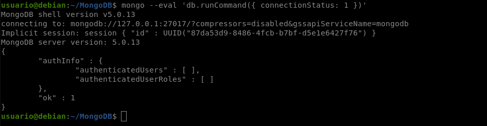
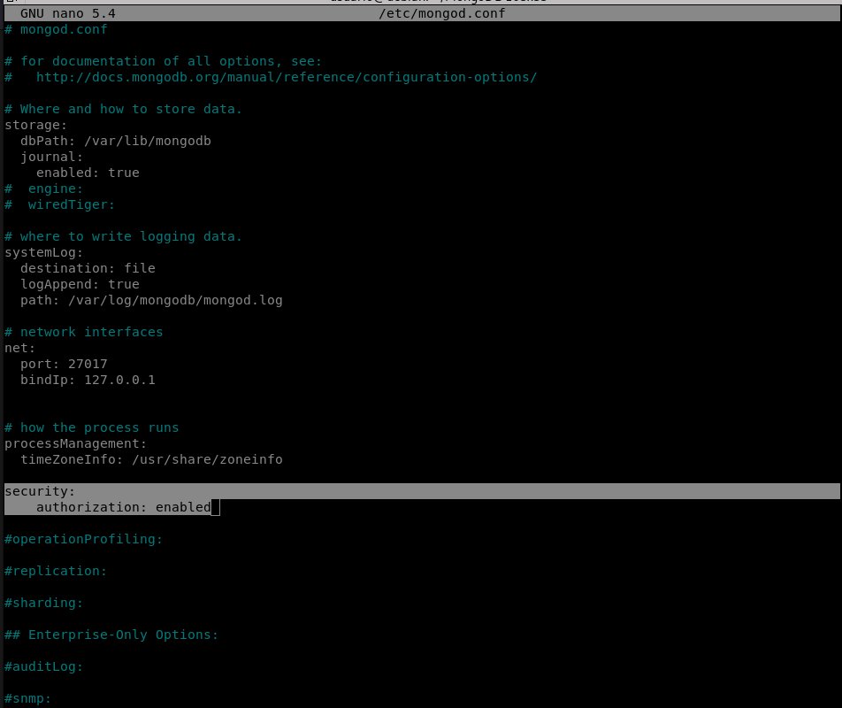
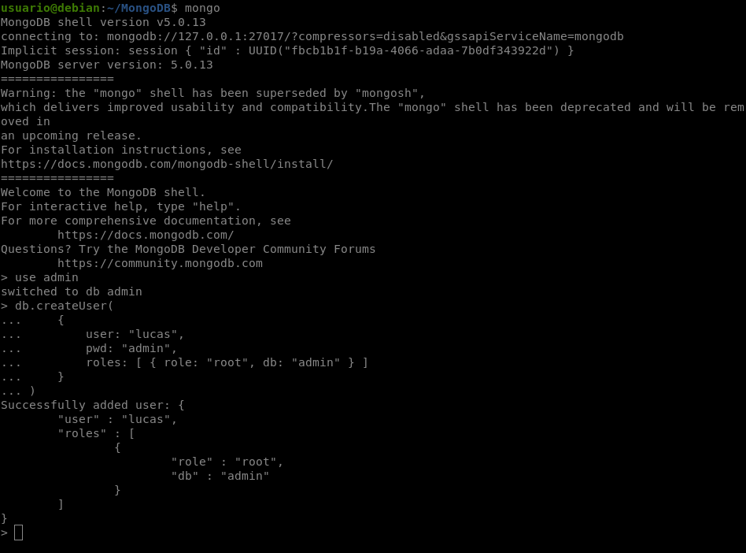

# MongoDB en Debian 11 Bullseye

## Instalación de MongoDB en Debian 11 Bullseye

**Paso 1** Instalar paquetes requeridos

    sudo apt install dirmngr gnupg apt-transport-https software-properties-common ca-certificates curl -y

**Paso 2** Importar repositorio de MongoDB

    sudo wget -O- https://www.mongodb.org/static/pgp/server-5.0.asc | gpg --dearmor | sudo tee /usr/share/keyrings/mongodb.gpg

**Paso 3** Agregamos el repositorio

    echo 'deb [signed-by=/usr/share/keyrings/mongodb.gpg] http://repo.mongodb.org/apt/debian buster/mongodb-org/5.0 main' | sudo tee /etc/apt/sources.list.d/mongodb-org-5.0.list

**Paso 4** Actualizamos

    sudo apt-get update

**Paso 5** Instalar MongoDB 5.0

    sudo apt install mongodb-org -y

**Paso 6** Activamos el servicio de mongodb

    sudo systemctl enable mongod --now

**Paso 7** Verificamos la version

    mongo --eval 'db.runCommand({ connectionStatus: 1 })'

**Paso 8** Configurar la seguridad de MongoDB

    sudo nano /etc/mongod.conf
---
    security:
        authorization: enabled

**Paso 9** Reiniciamos servicio

    sudo systemctl restart mongod

## Creación de usuario

**Paso 1** Crear usuario administrador en MongoDB

    mongo

**Paso 2** Nos conectamos como administrador

    use admin

**Paso 3** Creamos usuario

    db.createUser(
        {
            user: "lucas", 
            pwd: "admin", 
            roles: [ { role: "root", db: "admin" } ]
        }
    )

**Paso 4** Nos conectamos

    mongo --port 27017 --authenticationDatabase "admin" -u "lucas" -p
o tambien puedes probar con:

    mongosh -u lucas

## Creación de base de datos

**Iniciar MongoDB**

    mongo

**Crear y si ya esta creada usar base de datos**

    use 'NOMBRE_BD'

**Listar base de datos**

    show dbs

**Verificar la base de datos actual**

    db

**Eliminar base de datos**

Hacerlo dentro de la base de datos

    db.dropDatabase()

**Importar json en MongoDB**

Hacerlo fuera de mongo

    mongoimport --db NAME_BD --collection NAME_YOUR_COLLECTION --file 'ruta del json'

**Eliminar json de la base de datos**

Hacerlo dentro de la base de datos donde este el json

    db.NAME_COLLECTION.drop()

**Mostrar la coleccion**

    db.NAME_COLLECTION.find().pretty

¡Gracias!