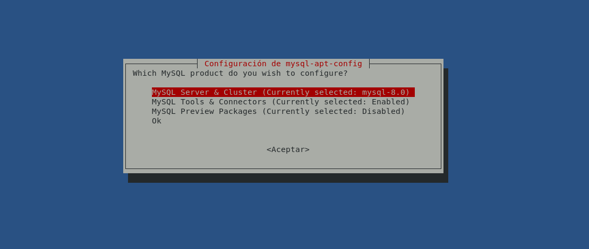
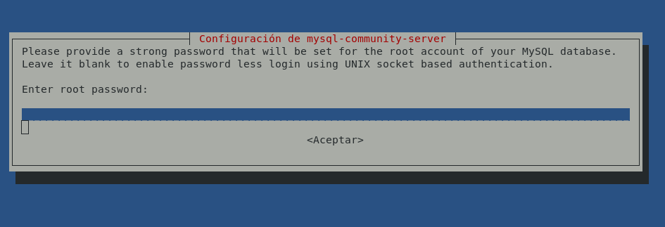
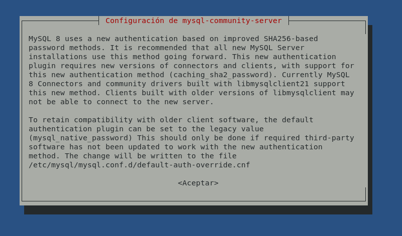
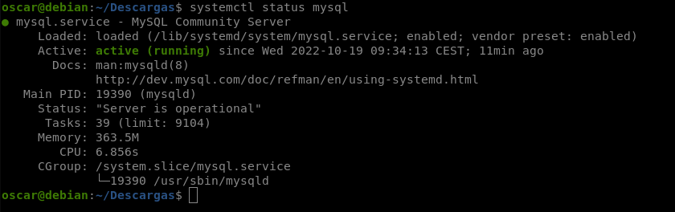
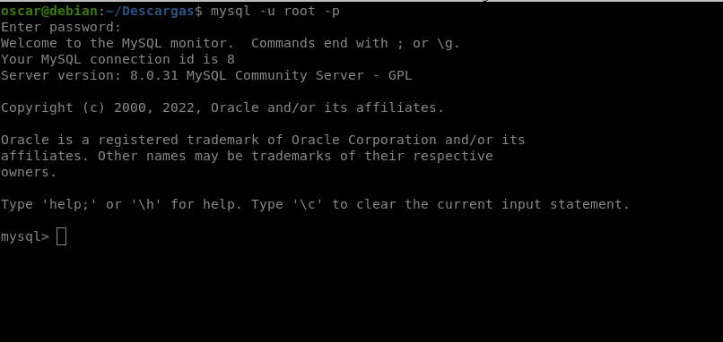
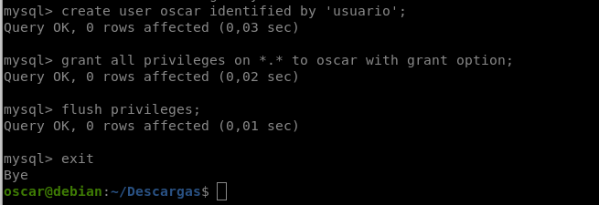
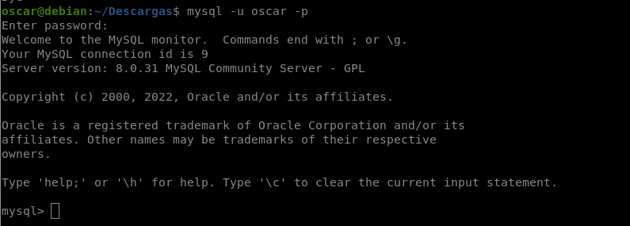

# Instalación de MySQL en Debian 11 Bullseye

Para conseguir una instalación correcta debemos cumplir los siguientes requisitos:

<input type="checkbox" name="vehicle" value="Bike"> Tener una maquina Debian 11 actualizada

<input type="checkbox" name="vehicle" value="Bike"> Tener un usuario con privilegios de sudo

<input type="checkbox" name="vehicle" value="Bike"> Tener acceso a internet

Antes de comenzar con la instalción actualizaremos nuestra maquina

    sudo apt update && sudo apt upgrade

E instalamos las herramientas

    sudo apt install -y gnupg wget

Despues de esto empezaremos ya con la instalación de MySQL.

## Configuración del repositorio de MySQL para Debian 11 Bullseye

Vamos a ver cómo configurar el repositorio oficial de MySQL Server para Debian 11.

Para no tener que registrarse en la pagina de mysql aqui os dejo el [enlace de descarga](https://dev.mysql.com/get/mysql-apt-config_0.8.22-1_all.deb)

Una vez ya con el paquete descargado procedemos con la instalación:

    cd Descargas && sudo dpkg -i mysql-apt-config_0.8.22-1_all.deb

Al instalarse este paquete se lanzará un pequeño configurador en modo consola que nos mostrará las características que ofrece por defecto el nuevo repositorio:

La primera opción nos muestra la versión de MySQL que se va a instalar, por defecto MySQL Server 8.0, aunque sería posible cambiarla por MySQL Cluster 8.0.

Por defecto, la segunda opción nos informa de que está activado el repositorio de herramientas y conectores, que es lo deseable, aunque podríamos desactivarlo.

Y, finalmente, la tercera opción ofrece un repositorio de software en pruebas, experimental, etc. que, con buen criterio, está desactivado inicialmente (aunque se puede activar).

Para salir del configurador seleccionaremos *Ok* y el instalador configurará el repositorio con los valores seleccionados.

Debemos actualizar la información de los repositorios para que se incluyan las nuevas listas de paquetes disponibles:

    sudo apt update && sudo apt upgrade

## Instalar MySQL en Debian 11

Ahora comenzaremos con la instalación de MySQL en Debian 11:

    sudo apt install -y mysql-server

Una vez descargados este paquete y sus dependencias, durante la instalación de los mismos, se nos solicitará la contraseña del usuario administrador root de MySQL:

Si dejamos la contraseña en blanco se usará la autenticación por sockets de Unix, es decir, sólo el usuario root de Debian 11 o usuarios privilegiados con sudo podrán conectar como usuario root de MySQL. En cambio, si creamos una contraseña se usará el típico sistema de usuario/contraseña para acceder como root a MySQL Server. Depende de tus necesidades o gustos elegir uno u otro sistema.

Este instalador también nos advierte de la disponibilidad del nuevo plugin mejorado de autenticación, que tiene la desventaja de no ser compatible con conectores y clientes antiguos:

Terminada esta pequeña configuración inicial, la instalación termina creando un nuevo servicio en Debian 11, el servicio mysql.service o simplemente mysql, que queda en ejecución y habilitado para su inicio automático.

Podemos comprobar en cualquier momento el estado de dicho servicio con el comando `systemctl`:

    systemctl status mysql

También disponemos del cliente de consola mysql que podemos utilizar para conectar al servicio con el usuario root, si elegimos el acceso por sockets de Unix:

    sudo mysql

O especificando usuario y contraseña:

    mysql -u root -p

### Crear un usuario administrador propio

Es posible que necesites un usuario administrador de MySQL Server con acceso mediante contraseña para conectar al servicio desde aplicaciones, gestores, clientes gráficos, conexiones remotas, etc. dejando al usuario root con acceso únicamente local.

Esto es fácil de hacer desde el cliente mysql, en el que creamos un usuario con contraseña:

    > create user *nombre-user* identified by *contraseña*; 

Y a continuación aplicamos permisos sobre todas las bases de datos y modificación de permisos de otros usuarios:

    > grant all privileges on *.* to *nombre-user* with grant option;

Refrescamos la tabla de permisos:
    
    > flush privileges;

Y cerramos la conexión:
    
    > exit

Y con esto ya tendríamos todo listo.

Y así podremos acceder a nuestro usuario ya creado

¡Gracias!