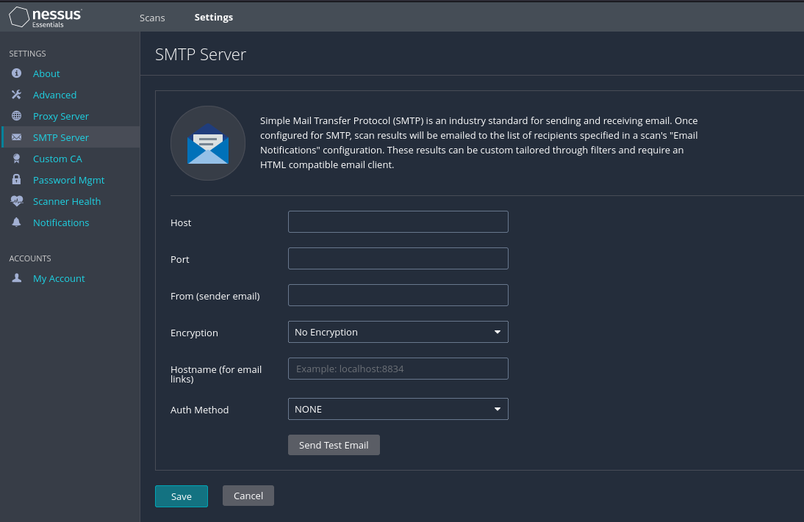
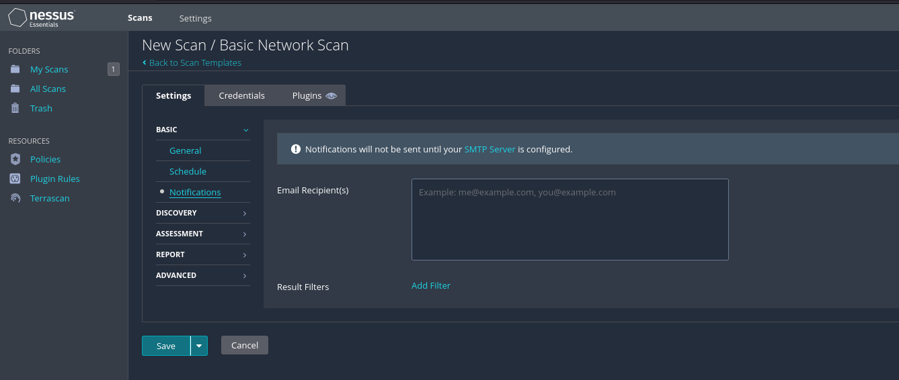

# Alertas de correos en Nessus

En este apartado explicaremos cómo crear notificaciones por correo electrónico en Nessus.

Una vez haya configurado la configuración del servidor SMTP, puede crear un escaneo o editar un escaneo existente para agregar esas notificaciones. 

Le daremos a "New Scan" y le daremos a "Basic Network Scan" (si no tenemos escaneado nada) y nos saldrá una opción de "Notifications"

Aqui colocaremos el mail al que queremos que nos llegue, luego puede adjuntar un informe en el formato CSV o PDF (tenga en cuenta el tamaño máximo del archivo adjunto), también puede agregar filtros adicionales para varios CD y filtros adicionales. Una vez que se complete el escaneo, recibirá una notificación por correo electrónico de que el escaneo ha terminado junto con el informe adjunto