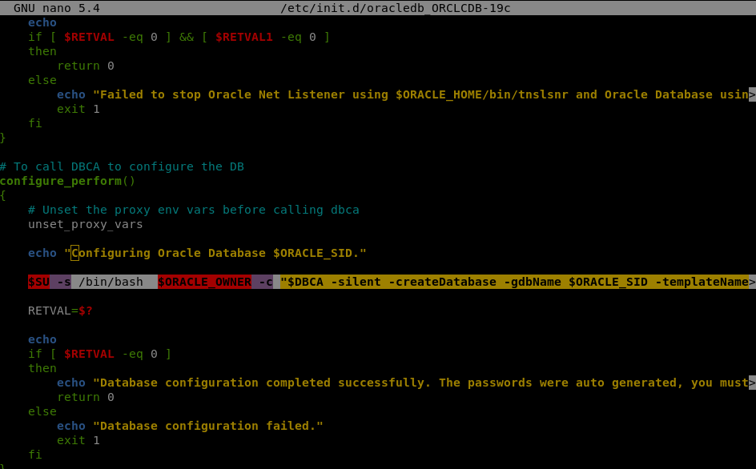
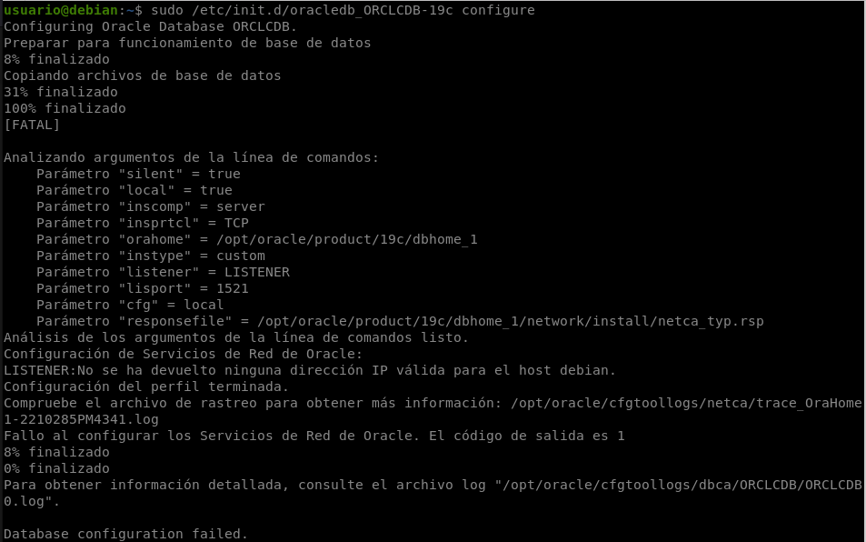
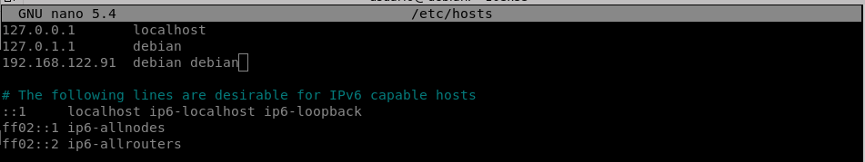
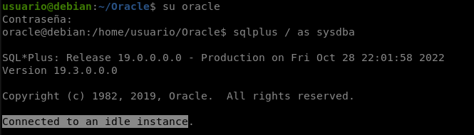
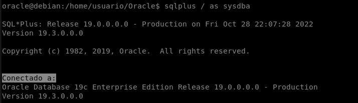
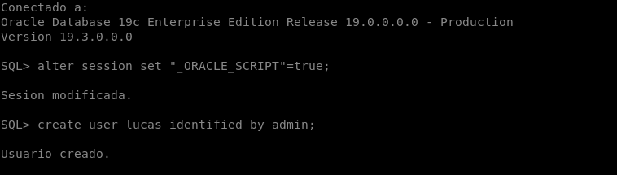

# Oracle en Debian 11 Bullseye

## Instalación de Oracle en Debian 11 Bullseye

**Paso 1**

Antes de instalar el paquete, tenemos que configurar algunas cosas. Empezaremos creando el script:

    sudo nano /sbin/chkconfig

Y copiamos estas líneas en el archivo:

    #!/bin/bash
    # Oracle XE installer chkconfig hack for Ubuntu
    file=/etc/init.d/oracle-xe
    if [[ ! `tail -n1 $file | grep INIT` ]]; then
    echo >> $file
    echo '### BEGIN INIT INFO' >> $file
    echo '# Provides: OracleXE' >> $file
    echo '# Required-Start: $remote_fs $syslog' >> $file
    echo '# Required-Stop: $remote_fs $syslog' >> $file
    echo '# Default-Start: 2 3 4 5' >> $file
    echo '# Default-Stop: 0 1 6' >> $file
    echo '# Short-Description: Oracle 19c Express Edition' >> $file
    echo '### END INIT INFO' >> $file
    fi
    update-rc.d oracle-xe defaults 80 01

**Paso 2**

Damos los permisos necesarios al archivo:

    sudo chmod 755 /sbin/chkconfig

**Paso 3**

Oracle 19c XE requiere de una configuración especial en kernel para funcionar. Por eso necesitamos añadir algunos parámetros al mismo.

    sudo nano /etc/sysctl.d/60-oracle.conf

Copiamos lo siguiente y guardamos.

    fs.file-max=6815744
    net.ipv4.ip_local_port_range=9000 65000
    kernel.sem=250 32000 100 128
    kernel.shmmax=536870912

**Paso 4**

Para cargar los parámetros del kernel sin reiniciar:

    sudo service procps start

**Paso 5** **Comienzo de la instalación**

Y ahora sí, instalamos el paquete [.deb](https://www.dropbox.com/s/p1vhrnjw73fdc70/oracle-database-ee-19c_1.0-2_amd64.deb?dl=0):

    sudo dpkg -i oracle-database-ee-19c_1.0-2_amd64.deb

Después de unos 10 minutos el proceso terminará. Ejecutamos el siguiente comando para configurar la contraseña de administrador de la base de datos y demás cosas:

    sudo /etc/init.d/oracledb_ORCLCDB-19c configure

Veremos que da error. Eso se debe a que en al script de configuración le hace falta un parámetro. Para añadirlo entramos en el script con:

    sudo nano /etc/init.d/oracledb_ORCLCDB-19c

Y buscamos(Ctrl + W) en la línea donde pone "Configuring"

Borramos la línea que se ve marcada en la imagen y copiamos en su lugar la siguiente:

    $SU -s /bin/bash  $ORACLE_OWNER -c "$DBCA -silent -createDatabase -gdbName $ORACLE_SID -templateName $TEMPLATE_NAME -characterSet $CHARSET -createAsContainerDatabase $CREATE_AS_CDB -numberOfPDBs $NUMBER_OF_PDBS -pdbName $PDB_NAME -createListener $LISTENER_NAME:$LISTENER_PORT -datafileDestination $ORACLE_DATA_LOCATION -sid $ORACLE_SID -autoGeneratePasswords -emConfiguration DBEXPRESS -emExpressPort $EM_EXPRESS_PORT -J-Doracle.assistants.dbca.validate.ConfigurationParams=false"

Ahora lo intentamos de nuevo:

    sudo /etc/init.d/oracledb_ORCLCDB-19c configure

`Nota: Si nos salta un error de netstat tendremos que instalarlo sudo apt install net-tools`

`Nota: Si nos sigue saliendo un error instalaremos lo siguiente sudo apt install libaio1 unixodbc`

Si te sale este error:

Sigue estos pasos:

    sudo nano /etc/hosts

Dentro del fichero escribe tu ip seguido del nombre de tu máquina dos veces, como se muestra en la siguiente imagen:

Y después de esto ejecutaremos de nuevo el comando y ya debería de ir sino reinicia la máquina (*sudo reboot*) y vuélvelo a probar 

**Paso 6**

Añadimos las variables de entorno a bash:

    nano ~/.bashrc

Copiamos las siguientes líneas al final del fichero:

    export ORACLE_HOME=/opt/oracle/product/19c/dbhome_1
    export ORACLE_SID=ORCLCDB
    export ORACLE_BASE=/opt/oracle
    export LD_LIBRARY_PATH=$ORACLE_HOME/lib:$LD_LIBRARY_PATH
    export PATH=$ORACLE_HOME/bin:$PATH

**Paso 7**

Para finalizar reiniciamos el servicio de Oracle 19c:

    sudo service oracledb_ORCLCDB-19c restart

Para iniciar Oracle ejecutaremos una serie de pasos:

**Primero pondremos una contraseña**

    passwd oracle

**Segundo entrasemos en oracle**

    su oracle

Seguramente te salga un `$`, si es así eso es que no tienes shell. Para solucionarlo ejecutaremos

    sudo usermod -s /bin/bash oracle

Y probaremos de nuevo:

    su oracle

Una vez dentro ya tendras shell y dentro ejecutaremos:

    sqlplus / as sysdba

Si esto no te va reinicia la maquina `sudo reboot` y prueba de nuevo

Bien, una vez echo esto si al iniciar te sale algo asi:

Ejecuta lo siguiente

    SQL> shutdown abort
---
    SQL> startup

Y ya estaría sal y entra de nuevo y te deberia salir algo así:

Acto seguido cambiaremos la contraseña del user SYS y SYSTEM

    SQL> alter user sys identified by TU_PASSWD;
---
    SQL> alter user system identified by TU_PASSWD;

## Creación de usuario

**Paso 1**

Ejecutamos el siguiente comando:

    SQL> alter session set "_ORACLE_SCRIPT"=true;

Y luego nos dejara crear el usuario

    SQL> create user lucas identified by admin;

!Gracias¡