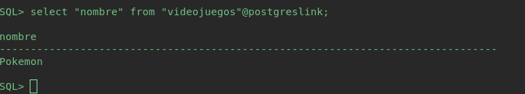
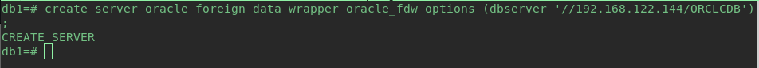

# Interconexión Servidores

<h2> Oracle - Oracle </h2>

Aquí vamos a interconectar dos servidores Oracle. Yo tendré dos máquinas las cuales son oracle1(192.168.122.179) y oracle2(192.168.122.144).

**Paso 1** Configuración del fichero tnsnames.ora.

Primero configuraremos el fichero tnsnames.ora y lo dejaremos de la siguiente manera:

    nano /opt/oracle/product/19c/dbhome_1/network/admin/tnsnames.ora

**oracle1**

**oracle2**

**Paso 2** Configuración del fichero listener.ora

A continuación editaremos el fichero listener.ora de la siguiente manera:

    nano /opt/oracle/product/19c/dbhome_1/network/admin/listener.ora

**oracle1**

**oracle2**

Y una vez modificados estos ficheros reiniciamos el servicio.

    lsnrctl stop
---
    lsnrctl start

**oracle1**

**oracle2**

**Paso 3** Creación del usuario

**oracle1**

Para la maquina oracle1 crearemos un usuario llamado `maquina1`.

    sqlplus / as sysdba
---
    alter session set "_ORACLE_SCRIPT"=true;
---
    create user maquina1 identified by root;
---
    grant all privileges to maquina1;

**oracle2**

Para la máquina oracle2 crearemos un usuario llamado `maquina2`.

    sqlplus / as sysdba
---
    alter session set "_ORACLE_SCRIPT"=true;
---
    create user maquina2 identified by root;
---
    grant all privileges to maquina2;

**Paso 4** Creacion de las tablas.

**oracle1**

    sqlplus maquina1/root
---
    create table peliculas (
        NombrePelicula varchar2(20),
        Genero varchar2(20),
        Director varchar2(20),
        AnoEstreno varchar2(4),
        constraint PK primary key (NombrePelicula)
    );
---
    INSERT INTO peliculas VALUES ('Dune','Ciencia-ficcion','Edwards','1984');
    INSERT INTO peliculas VALUES ('Los Idiotas','Drama','Von Trier','1999');
    INSERT INTO peliculas VALUES ('Kramer vs Kramer','Drama','Smith','1978');
    INSERT INTO peliculas VALUES ('Mision Imposible','Ciencia-ficcion','Johnson','1998');
    INSERT INTO peliculas VALUES ('Mi nombre es Joe','Drama','Loach','1995');
    INSERT INTO peliculas VALUES ('Rompiendo las olas','Drama','Von Trier','1997');
    INSERT INTO peliculas VALUES ('Los Otros','Suspense','Amenabar','2001');

**oracle2**

    sqlplus maquina2/root
---
    create table socios (
        DNI varchar2(10),
        Nombre varchar2(20),
        Direccion varchar2(20),
        constraint PK primary key (DNI)
    );
---
    INSERT INTO SOCIOS VALUES ('111-A','David','Sevilla Este');
    INSERT INTO SOCIOS VALUES ('222-B','Mariano','Los Remedios');
    INSERT INTO SOCIOS VALUES ('333-C','Raul','Triana');
    INSERT INTO SOCIOS VALUES ('444-D','Rocio','La Oliva');
    INSERT INTO SOCIOS VALUES ('555-E','Marilo','Triana');
    INSERT INTO SOCIOS VALUES ('666-F','Benjamin','Montequinto');
    INSERT INTO SOCIOS VALUES ('777-G','Carlos','Los Remedios');
    INSERT INTO SOCIOS VALUES ('888-H','Manolo','Montequinto');

**Paso 5** Interconexión.

Este paso lo haremos dentro del usuario que hemos creado en cada máquina.

**oracle1**

    create database link linkdb1 connect to maquina2 identified by root using 'ORCL2';

Ejemplo de funcionamiento (veremos que le podemos hacer una consulta a la tabla `socios` que se encuentra en la máquina `oracle2` en el usuario `maquina2`).

**oracle2**

    create database link linkdb2 connect to maquina1 identified by root using 'ORCL1';

Ejemplo de funcionamiento (veremos que le podemos hacer una consulta a la tabla `peliculas` que se encuentra en la máquina `oracle1` en el usuario `maquina1`).

<h2> PostgreSQL - PostgreSQL </h2>

Aquí vamos a interconectar dos servidores Postgres. Yo tendré dos máquinas las cuales son postgres1(192.168.122.27) y postgres2(192.168.122.53).

**Paso 1** Permitir acceso remoto

Para permitir el acceso remoto nos iremos al fichero postgresql.conf.

    sudo nano /etc/postgresql/13/main/postgresql.conf

Donde editaremos las línea de `listen_addresses`. Y la dejaremos así:

    listen_addresses = '*'          # what IP address(es) to listen on;

Después nos iremos al fichero `pg_hba.conf`.

    sudo nano /etc/postgresql/13/main/pg_hba.conf

Y escribiremos al final de este fichero las siguientes líneas:

    host    all     all     0.0.0.0/0       md5
    host    all     all     ::/0    md5

Una vez hecho esto reiniciamos el servicio postgresql.

    sudo systemctl restart postgresql

**Este paso lo haremos en las dos máquinas**

**Paso 2** Crearemos las bases de datos y sus respectivas tablas.

**postgres1**

Primero entraremos al usuario postgres.

    sudo su
---
    su postgres
---
    psql

Una vez dentro crearemos el usuario y la base de datos:

    postgres=# create user maquina1 with password 'root';
---
    postgres=# create database db1;
---
    postgres=# grant all privileges on database db1 to maquina1;
---
    postgres=# \q

Una vez ya creados el usuario y la base de datos entraremos en ella para crear las tablas:

    psql -h localhost -U maquina1 -W -d db1
---
    db1=> create table peliculas (
        NombrePelicula varchar (20),
        Genero varchar (20),
        Director varchar (20),
        AnoEstreno varchar (4),
        constraint PK_1 primary key (NombrePelicula)
    );
---
    db1=> INSERT INTO peliculas VALUES ('Dune','Ciencia-ficcion','Edwards','1984');
    INSERT INTO peliculas VALUES ('Los Idiotas','Drama','Von Trier','1999');
    INSERT INTO peliculas VALUES ('Kramer vs Kramer','Drama','Smith','1978');
    INSERT INTO peliculas VALUES ('Mision Imposible','Ciencia-ficcion','Johnson','1998');
    INSERT INTO peliculas VALUES ('Mi nombre es Joe','Drama','Loach','1995');
    INSERT INTO peliculas VALUES ('Rompiendo las olas','Drama','Von Trier','1997');
    INSERT INTO peliculas VALUES ('Los Otros','Suspense','Amenabar','2001');

**postgres2**

Ahora haremos lo mismo con la otra máquina.

    sudo su
---
    su postgres
---
    psql

Una vez dentro crearemos el usuario y la base de datos:

    postgres=# create user maquina2 with password 'root';
---
    postgres=# create database db2;
---
    postgres=# grant all privileges on database db2 to maquina2;
---
    postgres=# \q

Una vez ya creados el usuario y la base de datos entraremos en ella para crear las tablas:

    psql -h localhost -U maquina2 -W -d db2
---
    db1=> create table socios (
        DNI varchar (10),
        Nombre varchar (20),
        Direccion varchar (20),
        constraint PK_2 primary key (DNI)
    );
---
    db1=> INSERT INTO socios VALUES ('111-A','David','Sevilla Este');
    INSERT INTO socios VALUES ('222-B','Mariano','Los Remedios');
    INSERT INTO socios VALUES ('333-C','Raul','Triana');
    INSERT INTO socios VALUES ('444-D','Rocio','La Oliva');
    INSERT INTO socios VALUES ('555-E','Marilo','Triana');
    INSERT INTO socios VALUES ('666-F','Benjamin','Montequinto');
    INSERT INTO socios VALUES ('777-G','Carlos','Los Remedios');
    INSERT INTO socios VALUES ('888-H','Manolo','Montequinto');

**Paso 3** Interconexiones.

**postgres1**

Primero entraremos en la base de datos para crear la extensión del link. Esto lo haremos en el usuario postgres.

    psql -d db1
---
    db1=# create extension dblink;
---
    db1=# \q

    psql -h localhost -U maquina1 -W -d db1
---
    db1=> select * from dblink('dbname=db2 host=192.168.122.53 user=maquina2 password=root', 'select * from socios') as socios (dni varchar, nombre varchar, direccion varchar);

**postgres2**

Repetiremos los pasos pero ahora en la otra máquina.

    psql -d db2
---
    db1=# create extension dblink;
---
    db1=# \q

    psql -h localhost -U maquina2 -W -d db2
---
    db2=> select * from dblink('dbname=db1 host=192.168.122.27 user=maquina1 password=root', 'select * from peliculas') as peliculas (nombrepelicula varchar, genero varchar, director varchar, anoestreno varchar);

Como podemos comprobar ya podemos realizar interconexiones entre ambas máquinas.

<h2> Oracle - PostgreSQl </h2>

Aquí vamos a interconectar una máquina Oracle y una máquina PostgreSQL, las cuales son las que creamos para las otras interconexiones. Yo tendré dos máquinas las cuales son oracle2(192.168.122.144) y postgres1(192.168.122.27).

**Paso 1** Instalación de la paquetería necesaria.

    sudo apt install odbc-postgresql

**Paso 2** Configuramos el driver ODBC.

Una vez instalada la paqueteria accederemos al archivo `/etc/odbcinst.ini`, en el que está la configuración para los controladores unixODBC y lo dejaremos como se muestra en la imagen:

Crearemos un DSN llamado `odbc.ini` que determinará la conexión al gestor que especifiquemos.

Ya tendremos configurado el driver de ODBC, probaremos el resultado.

**NOTA**: `Como podemos observar en la captura anterior he creado una nueva tabla que es la que comprobaremos en el funcionamiento.`

Como podemos comprobar la configuración del driver ha sido exitosa, ahora procederemos a configurar Oracle para que pueda usar dicho driver.

**Paso 3** Configuración de Oracle para la interconexión.

Si todo ha ido bien hasta este punto, vamos a crear el fichero initPSQLU.ora. Este fichero nos permitirá crear el enlace con postgresql.

    sudo nano /opt/oracle/product/19c/dbhome_1/hs/admin/initPSQLU.ora

Y escribiremos lo siguiente:

    HS_FDS_CONNECT_INFO = PSQLU
    HS_FDS_TRACE_LEVEL = Debug
    HS_FDS_SHAREABLE_NAME = /usr/lib/x86_64-linux-gnu/odbc/psqlodbcw.so
    HS_LANGUAGE = AMERICAN_AMERICA.WE8ISO8859P1
    set ODBCINI=/etc/odbc.ini

Después configuraremos el fichero listener:

    sudo nano /opt/oracle/product/19c/dbhome_1/network/admin/listener.ora

Y también configuraremos el fichero tnsnames:

    sudo nano /opt/oracle/product/19c/dbhome_1/network/admin/tnsnames.ora

Después de haber configurado estos dos ficheros reiniciamos el servicio.

    lsnrctl stop
---
    lsnrctl start

Y una vez hecho esto accedemos a nuestro usuario oracle y crearemos un enlace para comprobar la configuración.

Creamos el link:

Y comprobamos el funcionamiento:

<h2> PostgreSQL - Oracle </h2>

Aquí vamos a interconectar una máquina PostgreSQL y una máquina Oracle, las cuales son las que creamos para las otras interconexiones. Yo tendré dos máquinas las cuales son postgres1(192.168.122.27) y oracle2(192.168.122.144).

**Paso 1** Instalamos la paquetería requerida.

    sudo apt install libaio1 postgresql-server-dev-all build-essential git

**Paso 2** Descargamos los paquetes clientes de Oracle.

Accedemos al usuario de postgres y descargamos los paquetes del sitio oficial de Oracle:

    su - postgres
---
    wget https://download.oracle.com/otn_software/linux/instantclient/211000/instantclient-basic-linux.x64-21.1.0.0.0.zip
---
    wget https://download.oracle.com/otn_software/linux/instantclient/211000/instantclient-sdk-linux.x64-21.1.0.0.0.zip
---
    wget https://download.oracle.com/otn_software/linux/instantclient/211000/instantclient-sqlplus-linux.x64-21.1.0.0.0.zip

Descomprimimos los archivos con unzip:

    unzip instantclient-basic-linux.x64-21.1.0.0.0.zip
---
    unzip instantclient-sqlplus-linux.x64-21.1.0.0.0.zip
---
    unzip instantclient-sdk-linux.x64-21.1.0.0.0.zip

Después de descomprimir los 3 archivos se nos creará una carpeta llamada `instantclient_21_1`.

**Paso 3** Estableceremos las nuevas variables de entorno.

    export ORACLE_HOME=/var/lib/postgresql/instantclient_21_1
---
    export LD_LIBRARY_PATH=$LD_LIBRARY_PATH:$ORACLE_HOME
---
    export PATH=$PATH:$ORACLE_HOME

Para comprobar si hemos puesto correctamente las variables utilizaremos el comando wich que nos deberá devolver la ruta.

    cd /var/lib/
---
    which sqlplus

Y una vez hecho esto ya nos podremos conectar remotamente:

**Paso 4** Compilación de oracle_fdw.

Descargamos el repositorio de GitHub con el código fuente.

    wget https://github.com/laurenz/oracle_fdw/archive/refs/tags/ORACLE_FDW_2_3_0.zip
---
    unzip ORACLE_FDW_2_3_0.zip

Para evitar futuros problemas, le cambiamos el nombre al directorio extraído por oracle_fdw:

    mv oracle_fdw-ORACLE_FDW_2_3_0/ oracle_fdw

Entramos en el directorio oracle_fdw, compilamos el código y realizamos la instalación:

    cd oracle_fdw
---
    make
---
    make install

Al entrar en la base de datos e intentar crear la extensión, nos informarán de que el sistema no encuentra las librerías de oracle:

Para solucionar esto crearemos el fichero `/etc/ld.so.conf.d/oracle.conf` y dentro añadiremos las rutas de los directorios que contengan los ficheros .so:

    sudo nano /etc/ld.so.conf.d/oracle.conf
---
    /var/lib/postgresql/instantclient_21_1
    /usr/share/postgresql/11/extension

Ejecutamos el comando ldconfig, con el que se crearán los vínculos y caché necesarios a las librerías que se encuentren en los directorios que hemos especificado en el fichero creado, y reiniciamos el servicio de PostgreSQL:

    sudo ldconfig
---
    sudo systemctl restart postgresql

Y después de hacer esto ya podremos crear la extensión:

Después creamos un nuevo esquema al que importamos las tablas de la base de datos Oracle:

Como el esquema que hemos creado está vacío, definiremos un servidor remoto que use la extensión que hemos generado antes, indicando la dirección IP y la base de datos que tenemos en Oracle:

Luego de esto, necesitamos mapear nuestro usuario local a uno existente en Oracle con los privilegios necesarios para acceder a las tablas:

Otorgamos a nuestro usuario de PostgreSQL los privilegios para utilizar el esquema de Oracle y el servidor remoto:

Y una vez hecho todo esto importamos las tablas existentes en el esquema remoto al local:

Y hacemos la prueba del funcionamiento:

¡Gracias!