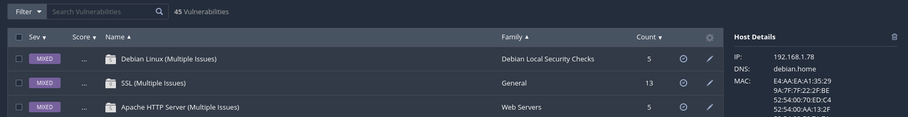
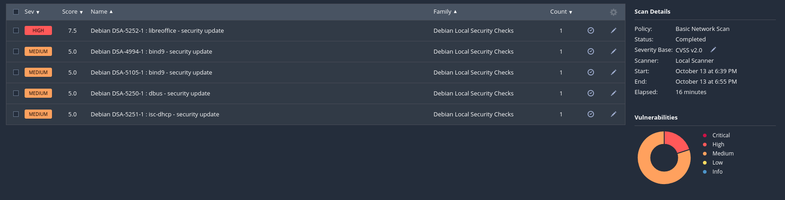
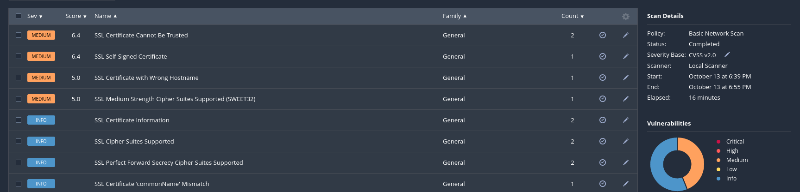
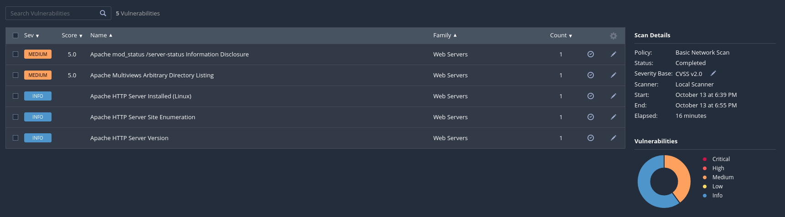
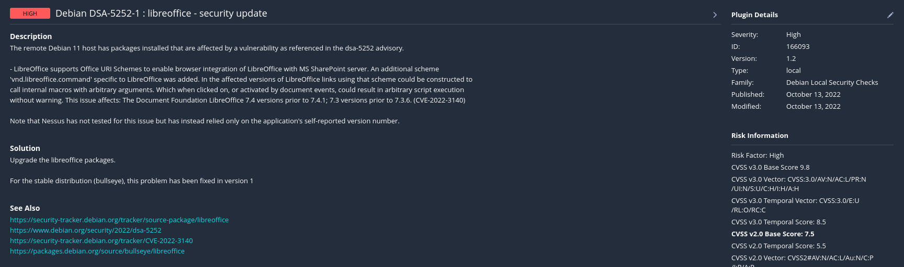
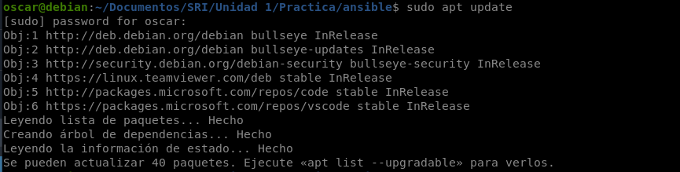
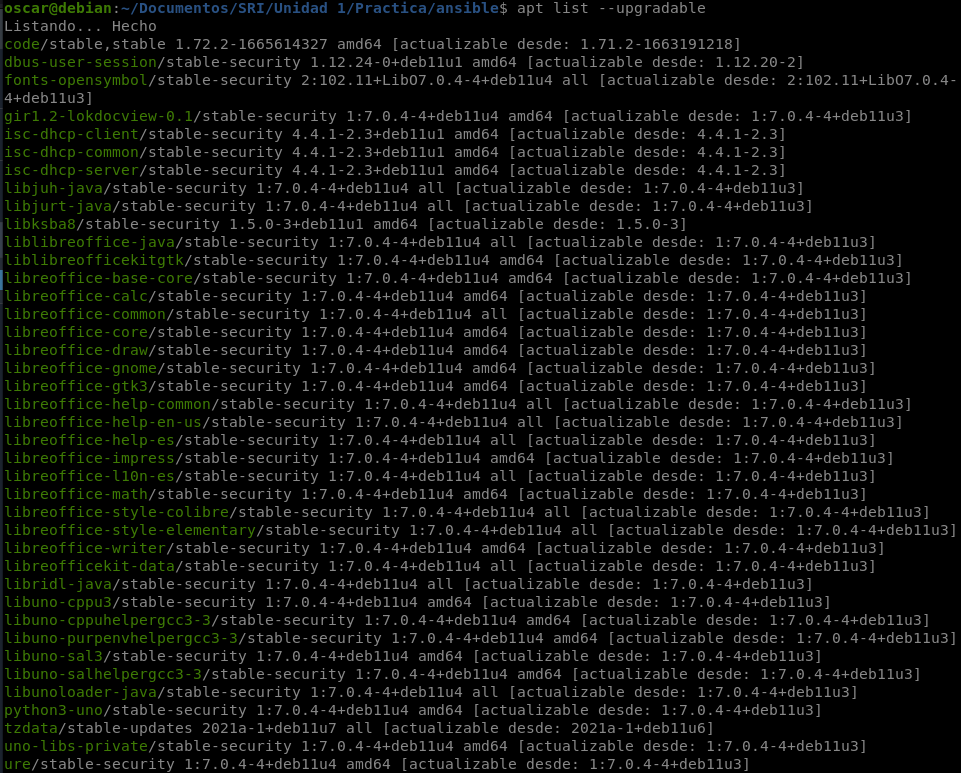
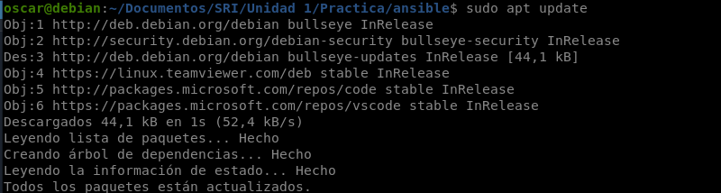
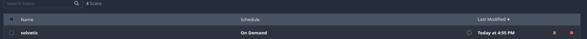

Para parchear las vulnerabilidades que nos dan algún error debemos seguir los siguientes pasos

**Paso 1** Busqueda de vulnerabilidades erroneas

Como vemos aqui nos muestra algunas vulnerabilidades que nos dan error

Si entramos dentro de cada una, una de las grandes funciones que tiene Nessus es que dentro de la ulnerabiliadad nos muestra una solucion a ese error y solo lo tendriamos que poner en marcha 

**Paso 2** Solución de vulnerabilidades erroneas

En mi caso los problemas eran por tener paquetes que tenia que actualizar. Pues para solucionarlo nos iremos a la maquina donde sacamos las vulnerabilidades y actualizaremos los paquetes que nos dan problemas

**Paso 3** Finalización

Y ya con esto ya tendriamos solucionado los errores y solo nos faltaria dirigirnos a Nessus y volver a escanear la maquina

Y como podemos observar las vulnerabilidades erroneas se nos han quitado

