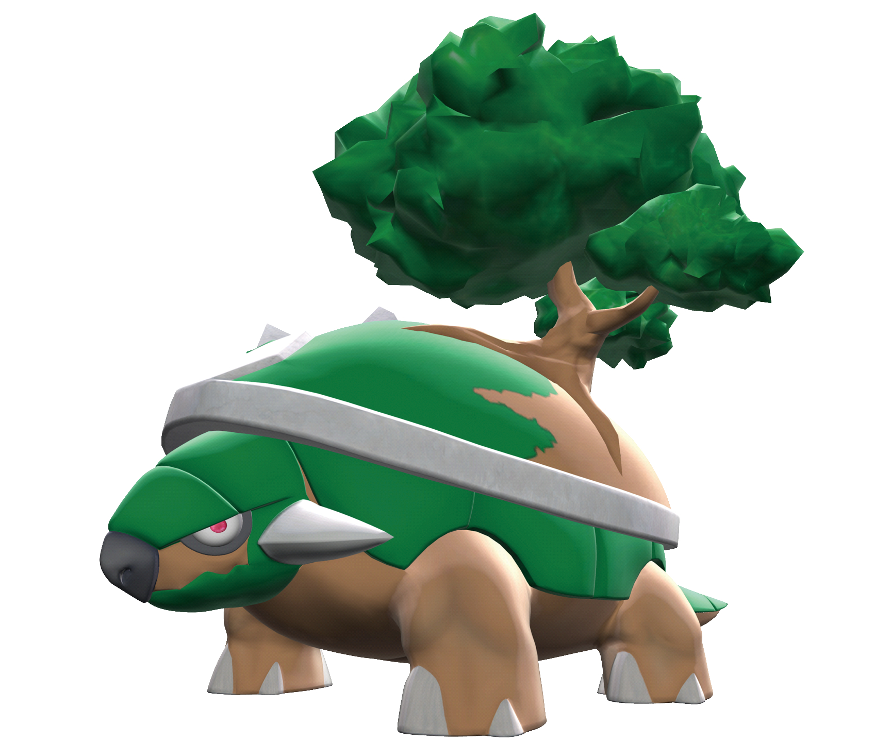

## Torterra

**Hablaremos del pokemon Torterra.**

***Características:***

Especie `Continente`

Tipo `planta` `tierra`

Habilidad `Espesura`

Hab. oculta `Caparazón`

Peso `310.0 kg`

Altura `2.2 m`

