# PostgreSQL en Debian 11 Bullseye

## Instalación de PostgreSQL en Debian 11 Bullseye

**Paso 1** Actualizar el sistema

    sudo apt update && sudo apt upgrade -y

**Paso 2** Instalamos postgresql

    sudo apt install -y postgresql*

Esto tardará un poco

**Paso 3** Comprobamos el estado del servicio

    systemctl status postgresql

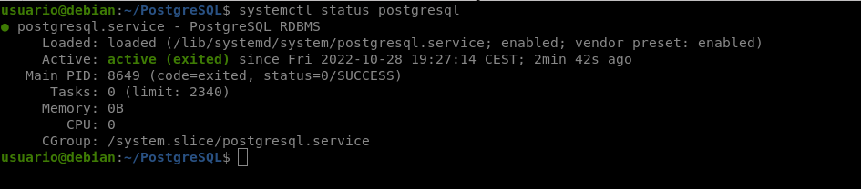

En el caso que no estuviera iniciado lo iniciaremos

    systemctl start postgresql

**Paso 4** Instalamos el cliente

    sudo apt install -y postgresql-client

### Comandos de navegación y consulta de información

- `\c` Saltar entre bases de datos

- `\l` Listar base de datos disponibles

- `\dt` Listar las tablas de la base de datos

- `\d <nombre_tabla>` Describir una tabla

- `\dn` Listar los esquemas de la base de datos actual

- `\df` Listar las funciones disponibles de la base de datos actual

- `\dv` Listar las vistas de la base de datos actual

- `\du` Listar los usuarios y sus roles de la base de datos actual

### Comandos de inspección y ejecución

- `\g` Volver a ejecutar el comando ejecutando justo antes

- `\s` Ver el historial de comandos ejecutados

- `\s <nombre_archivo>` Si se quiere guardar la lista de comandos ejecutados en un archivo de texto plano

- `\i <nombre_archivo>` Ejecutar los comandos desde un archivo

- `\e` Permite abrir un editor de texto plano, escribir comandos y ejecutar en lote. \e abre el editor de texto, escribir allí todos los comandos, luego guardar los cambios y cerrar, al cerrar se ejecutarán todos los comandos guardados.

- `\ef` Equivalente al comando anterior pero permite editar también funciones en PostgreSQL

### Comandos para debug y optimización

- `\timing` Activar `/` Desactivar el contador de tiempo por consulta

### Comandos para cerrar la consola

- `\q` Cerrar la consola

## Creación de usuario

Para crear el usuario ingresamos primero a postgres:

    sudo -u postgres psql
    
**Crearemos el usuario:**

    CREATE USER lucas PASSWORD 'TU_PASSWORD';

**Asignar permisos de superusuario a un usuario**

    ALTER ROLE lucas WITH SUPERUSER;

**Cambiar la contraseña de un usuario**

    ALTER ROLE lucas WITH PASSWORD 'NUEVO_PASSWORD';

**Crear una base de datos con un usuario específico como propietario**

    CREATE DATABASE lucas_db WITH OWNER lucas;

**Asignar todos los permisos a un usuario a una base de datos existente**

    GRANT ALL PRIVILEGES ON DATABASE lucas_db TO lucas;

## Acceso remoto

**Paso 1** Acceso remoto

    sudo nano /etc/postgresql/13/main/postgresql.conf

Busca la siguiente línea:

`#listen_addresses = 'localhost'         # what IP address(es) to listen on;`

Y sustituye 'localhost' por '*':

**Paso 2** Activamos contraseñas de red

El siguiente paso es configurar el fichero "pg_hba.conf" para permitir el acceso remoto desde cualquier dirección. Para ello ejecuta lo siguiente:

    sudo nano /etc/postgresql/13/main/pg_hba.conf

Añade al final del fichero las siguientes líneas:

    host    all      all              0.0.0.0/0                    md5
    host    all      all              ::/0                         md5

**Paso 3** Reiniciamos el servicio

    sudo systemctl restart postgresql.service

**Paso 4** Añadimos regla de firewall

    sudo ufw allow postgresql
---

**Paso 5** Nos conectamos

    psql -h ip-server -U nombre-user -p nombre-db

Ejemplo:

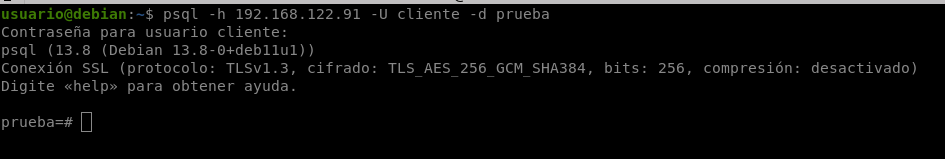

## Instalación herramienta de administración web

En mi caso vamos a instalar la herramienta `pgadmin4`

**Paso 1** Instala el paquete gnupg2 mediante el comando apt que aparece a continuación

    apt install gnupg gnupg2

**Paso 2** A continuación, ejecuta el siguiente comando para añadir el repositorio de pgAdmin para el sistema Debian.

    echo "deb https://ftp.postgresql.org/pub/pgadmin/pgadmin4/apt/$(lsb_release -cs) pgadmin4 main"\ | sudo tee /etc/apt/sources.list.d/pgadmin4.list

**Paso 3** Añade la clave gpg del repositorio pgAdmin utilizando el siguiente comando

    curl https://www.pgadmin.org/static/packages_pgadmin_org.pub | sudo apt-key add

**Paso 4** Refresca y actualiza todos los repositorios utilizando el siguiente comando

    sudo apt update

Ahora estás listo para instalar pgAdmin en el sistema Debian.

### Instalación y configuración de pgAdmin4 en Debian 11

**Paso 1** Para instalar pgAdmin en modo servidor, instala el paquete ‘pgadmin4-web’ utilizando el comando apt que aparece a continuación.

    apt install pgadmin4-web

Escribe `y` y pulsa `Enter` para continuar la instalación.

**Paso 2** Si la instalación se ha completado, ejecuta el siguiente comando para configurar la cuenta de usuario de pgAdmin4 y la configuración del host virtual de apache.

    /usr/pgadmin4/bin/setup-web.sh

Escribe el correo electrónico y la contraseña del usuario para crear un nuevo usuario pgAdmin, y luego pulsa `Enter`.

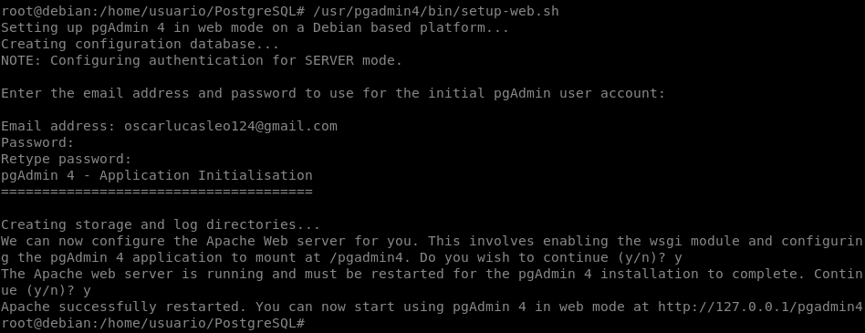

Después, se te pedirá que configures el servidor web Apache, escribe `y`, y pulsa `Enter`.

Ahora la instalación de pgAdmin es accesible en la ruta URL `/pgadmin4`.

El script de instalación `setup-web.sh` creará y activará automáticamente la configuración de apache en el directorio `/etc/apache2/conf-enabled`. Puedes comprobarlo con el siguiente comando.

A continuación se muestra la configuración que verás.

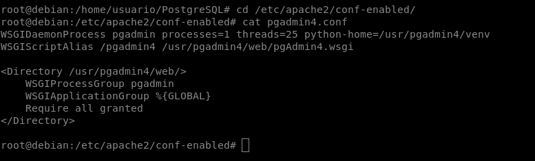

### Verificar la instalación de pgAdmin

**Paso 1** Abre tu navegador web y escribe la dirección IP del servidor o el nombre del dominio seguido de la ruta ‘/pgadmin4’ como se indica a continuación.

    tu-ip/pgadmin4

**Paso 2** Si la instalación se ha realizado correctamente, verás la página de inicio de sesión de pgadmin4 como se indica a continuación.

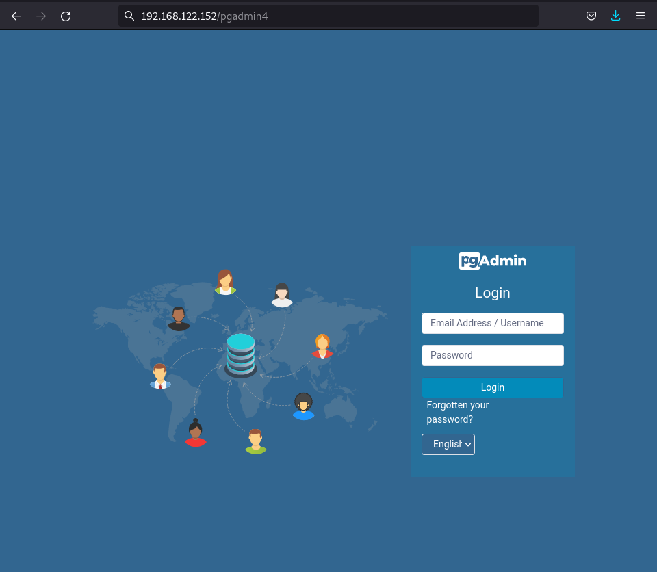

Escribe tu usuario de acceso y tu correo electrónico, y luego haz clic en el botón `Login`.

Ahora verás el panel de control de pgadmin4 como se indica a continuación.

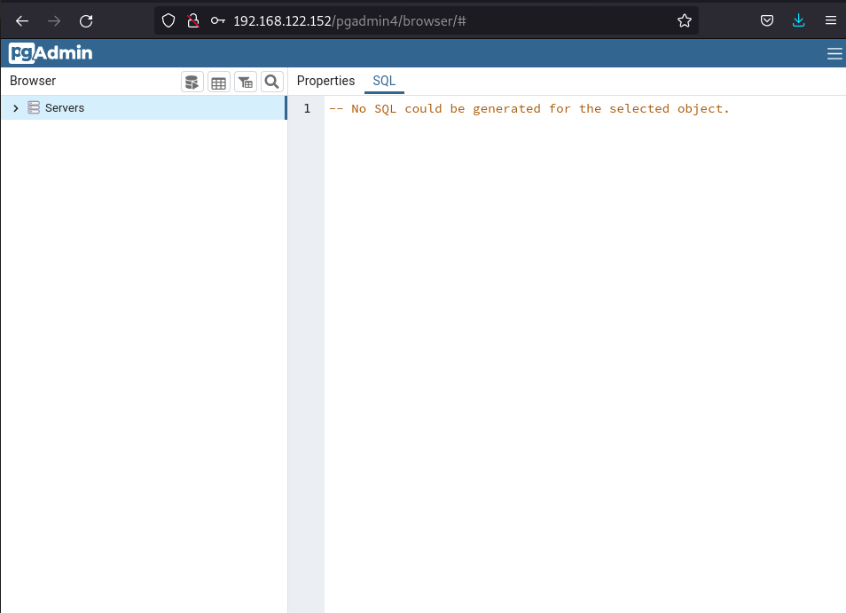

### Conectar con el servidor PostgreSQL con pgAdmin4

Después de entrar en el tablero de pgAdmin, añadirás una nueva conexión a tu servidor PostgreSQL.

**Paso 1** En el tablero de pgAdmin, haz clic en el icono `Añadir nuevo servidor`

**Paso 2** Aparecerá una pequeña ventana emergente.

En la pestaña `General`, escribe un nuevo `Nombre` de tu conexión.

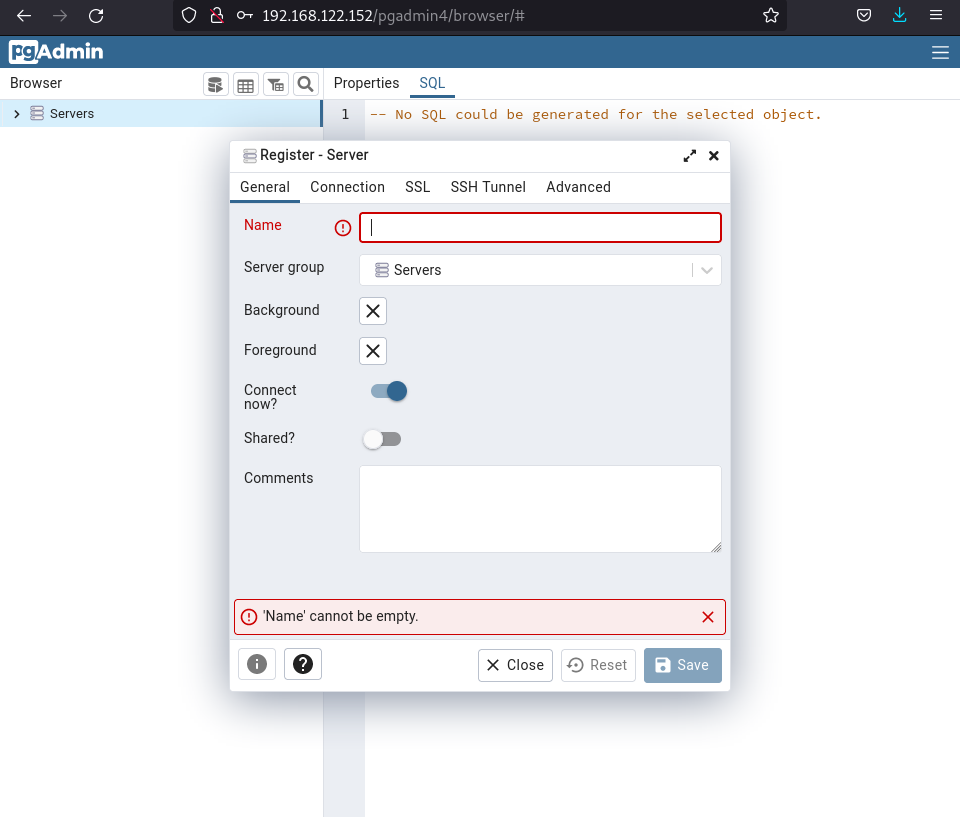

Para esta guía, daremos a la nueva conexión el nombre de `local`.

**Paso 3** Pasa a la pestaña `Conexión` y escribe tus datos de host PostgreSQL, base de datos, usuario y contraseña.

Para este ejemplo, utilizaremos el servidor PostgreSQL local con el usuario `lucas` para gestionar una base de datos predeterminada `postgres`.

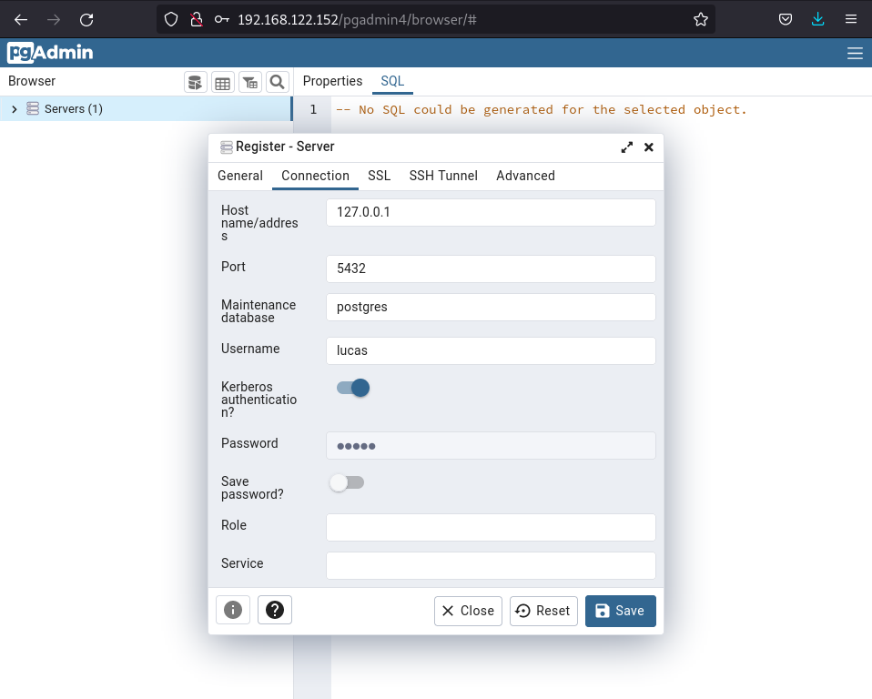

Después, haz clic en el botón `Guardar` para guardar una nueva conexión.

**Paso 4** Si la conexión se realiza con éxito, verás una página similar a la siguiente. En caso contrario, verás un error

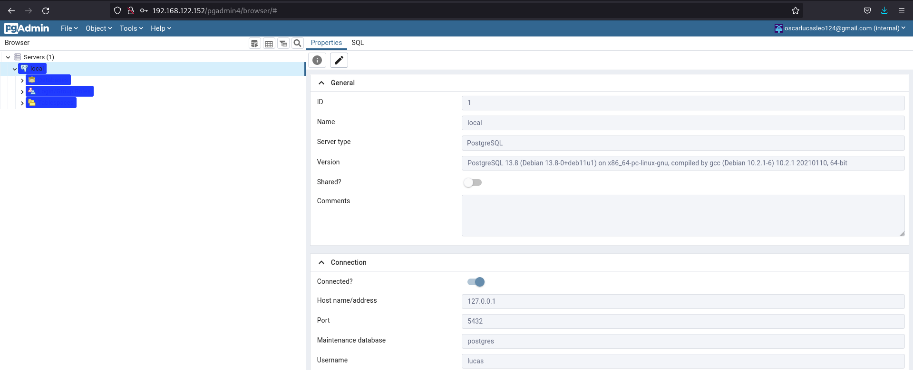

Como puedes ver en la parte inferior de la captura de pantalla, el usuario `lucas` está conectado a la base de datos `postgres` con la aplicación `pgAdmin4`, y el estado de la conexión es `activò`.

### Creación de un nuevo usuario en pgAdmin4

En esta etapa, vas a crear un nuevo usuario de PostgreSQL utilizando la herramienta pgAdmin4.

**Paso 1** Haz clic con el botón derecho del ratón sobre el nombre de la conexión en el menú `local => Crear => Rol de inicio de sesión/grupo..`.

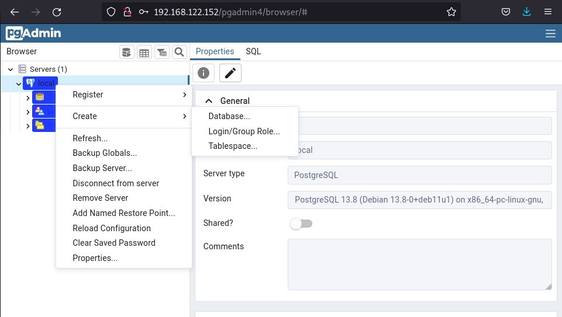

**Paso 2** En la pestaña `General`, escribe el nuevo usuario que quieres crear. Para este ejemplo, crearás un nuevo usuario `prueba`.

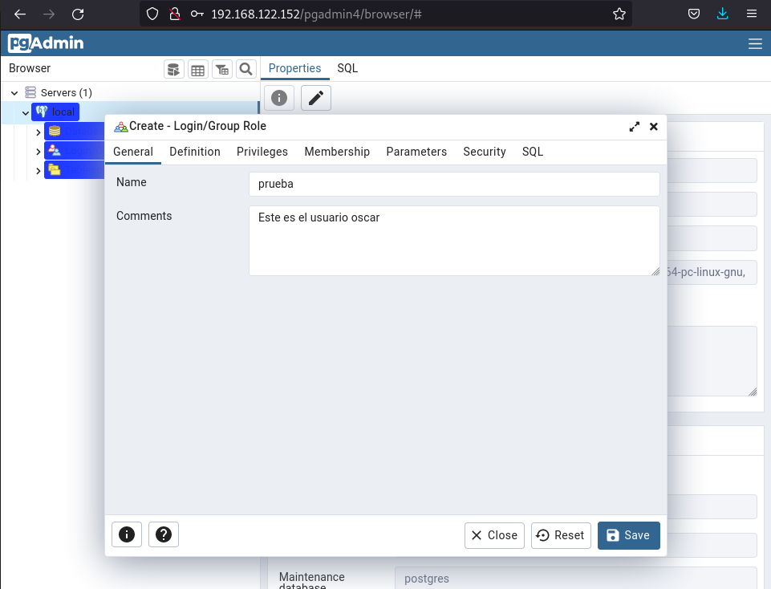

**Paso 3** Pasa a la pestaña `Definición` y escribe la contraseña de tu usuario.

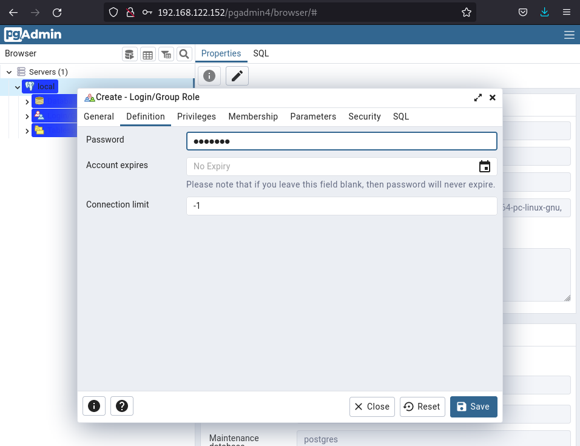

**Paso 4** Ve a la pestaña **«Privilegios»** y activa los privilegios que necesites.

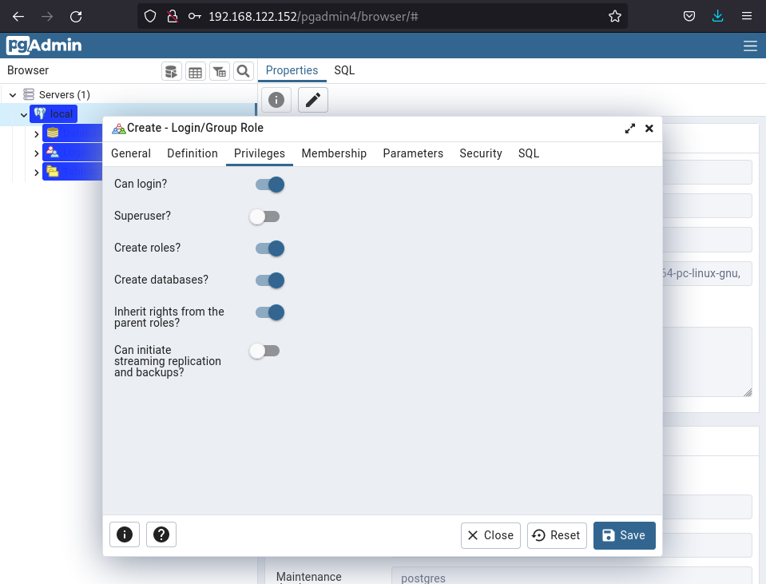

Ahora haz clic en el botón `Guardar`.

**Paso 5** Para verificar tu nuevo usuario, haz clic en el menú `Roles de inicio de sesión/grupo` de la izquierda, y luego haz clic en el `prueba` que acabas de crear.

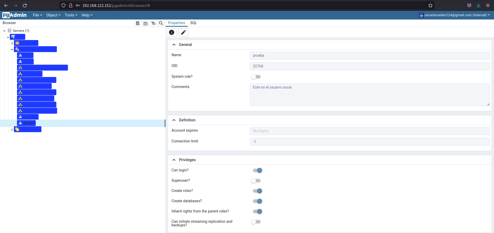

**Paso 6** Haz clic en la pestaña`Propiedades` de la página y obtendrás detalles del usuario como en la captura de pantalla superior.

### Creación de una nueva base de datos en pgAdmin4

En esta etapa, crearás una nueva base de datos desde el panel de control de pgAdmin.

**Paso 1** Haz clic con el botón derecho del ratón en el menú del nombre de la conexión `local => Crear => Base de datos..`.

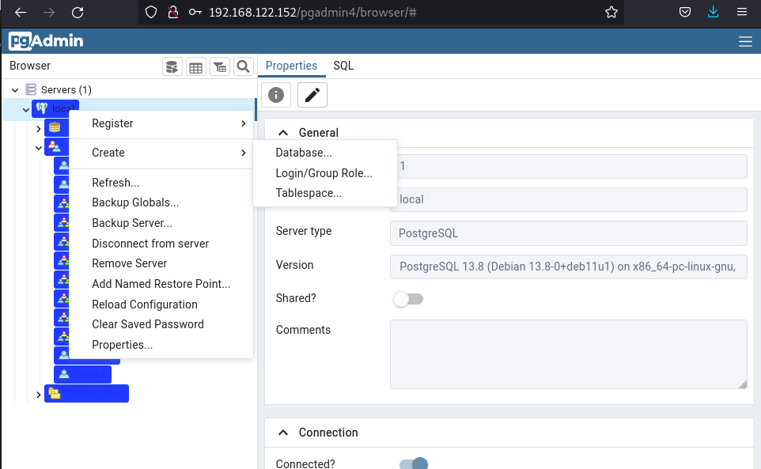

**Paso 2** En la pestaña `General`, escribe el nombre de tu nueva base de datos y elige el usuario propietario de la misma. Para este ejemplo, crearás una nueva base de datos `pruebadb` y harás al usuario `prueba` como propietario.

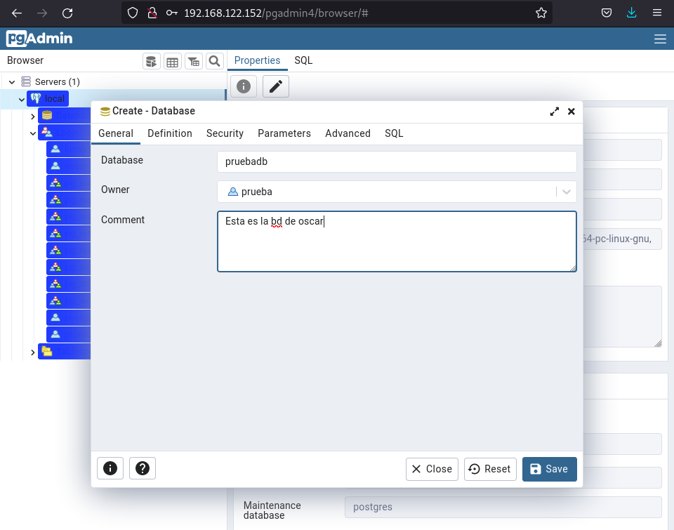

Ahora haz clic en el botón `Guardar`.

**Paso 3** Para verificar tu nueva base de datos, haz clic en el menú `Bases de datos` de la izquierda, y luego haz clic en la base de datos `pruebadb` que acabas de crear.

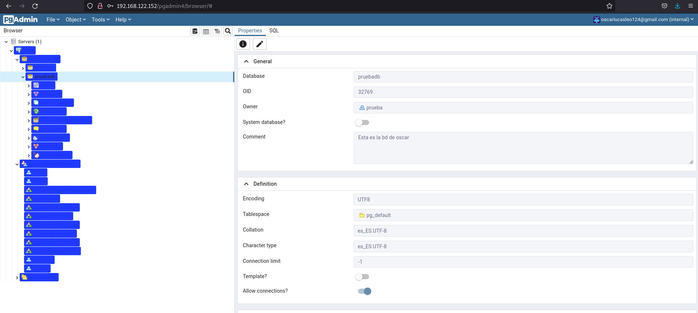

Haz clic en la pestaña `Propiedades` de la página y obtendrás los detalles de la base de datos `pruebadb` como en la captura de pantalla superior.

### Verificar la conexión del usuario

Después de crear un nuevo usuario y una base de datos utilizando el pgAdmin4, crearás una nueva conexión PostgreSQL en el pgAdmin4 utilizando el usuario `prueba` y la base de datos `pruebadb`.

**Paso 1** Vuelve al panel de control de pgAdmin4 y haz clic en el icono `Añadir nuevo servidor`.

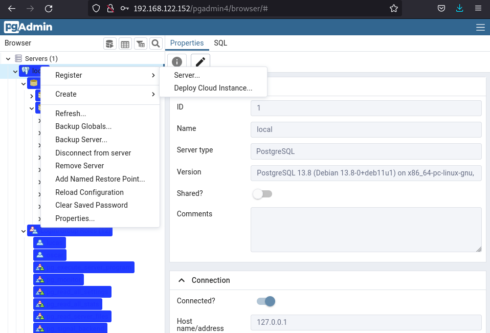

**Paso 2** En la pestaña `General`, escribe el nombre de la nueva conexión como `prueba-connection`, como se indica a continuación.

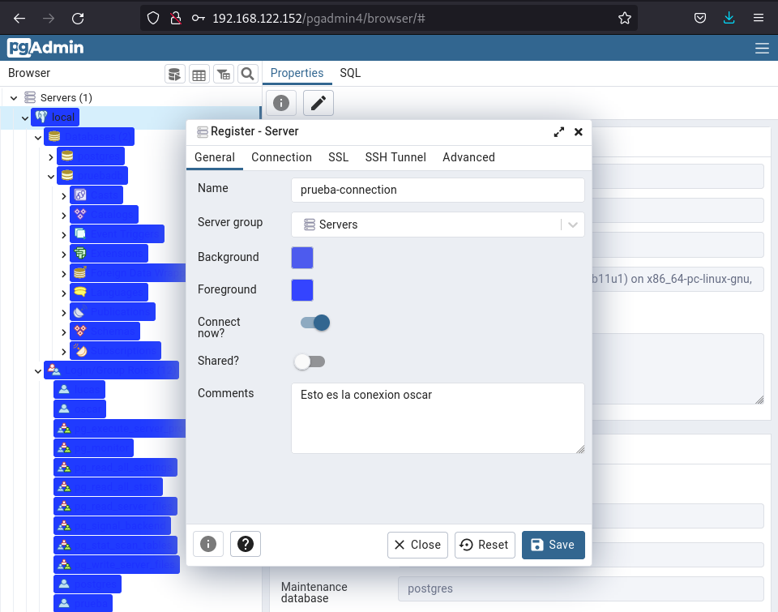

**Paso 3** Pasa a la pestaña `Conexión` y escribe los detalles de la nueva conexión. El host es `127.0.0.1` con el usuario `prueba`, y gestionará la base de datos `pruebadb`, y no olvides escribir la contraseña del usuario `prueba`.

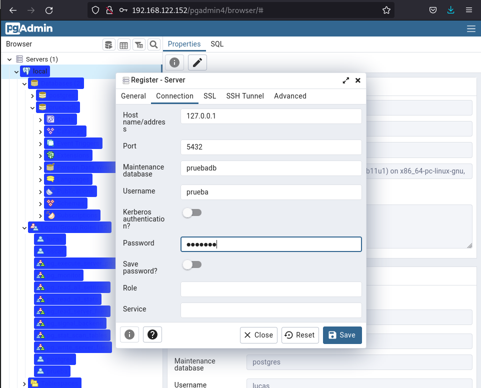

Ahora haz clic en el botón `Guardar`.

**Paso 4** Si tus credenciales de la base de datos son correctas, verás una página similar a la siguiente.

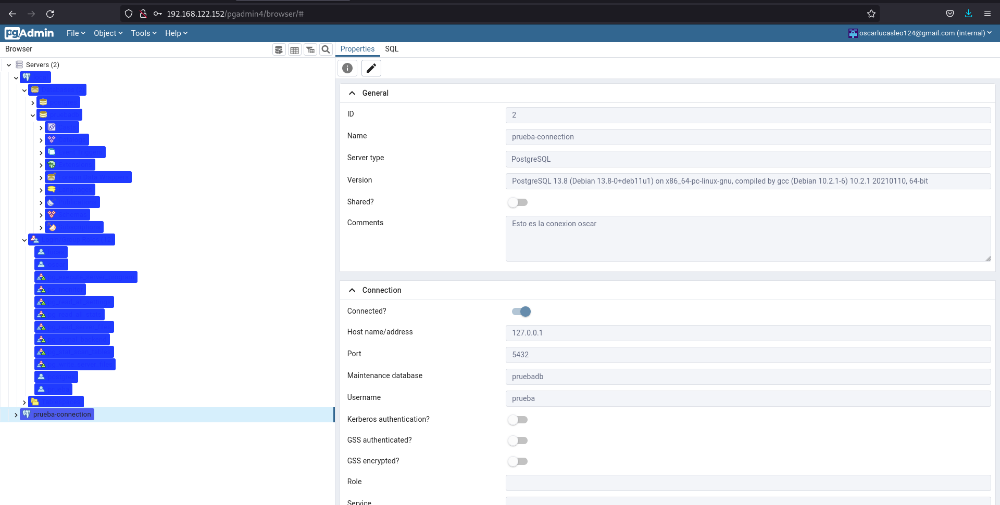

Como puedes ver en la parte inferior de la captura de pantalla, el usuario `prueba` está conectado a la base de datos `pruebadb` con la aplicación `pgAdmin4`, y el estado de la conexión es `activo`.

¡Gracias!